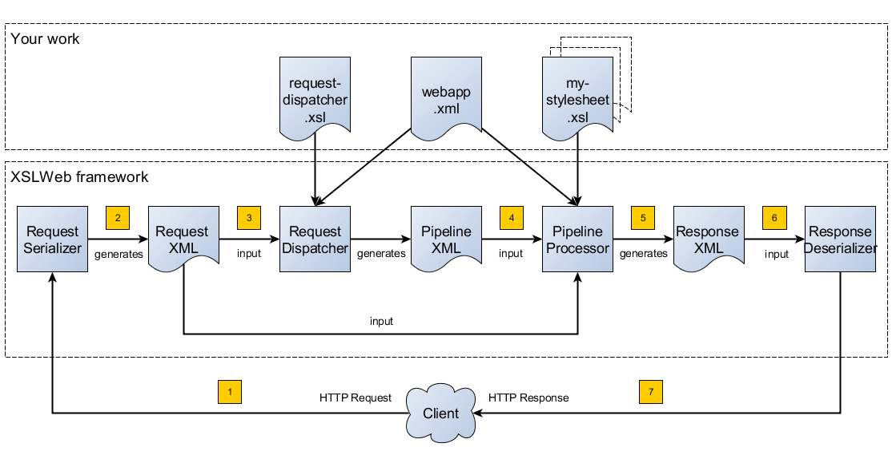

:description: XSLWeb Developer Manual 
:keywords: XSLWeb XML, XSLT, XML Schema, Schematron, Web development
:doctype: book
:page-layout!:
:toc: left
:toclevels: 3
:sectanchors:
:sectlinks:
:sectnums:
:icons: font
:source-highlighter: highlightjs
:highlightjs-theme: agate
:highlightjsdir: highlight
:source-language: asciidoc
:experimental:
:stem:
:idprefix:
:idseparator: -
:ast: &ast;
:dagger: pass:normal[^&dagger;^]
:endash: &#8211;
:y: icon:check[role="green"]
:n: icon:times[role="red"]
:c: icon:file-text-o[role="blue"]
:table-caption!:
:example-caption!:
// :figure-caption!:
:figure-caption: Figure
:imagesdir: images
:includedir: includes
:underscore: _
:docinfo: shared,shared-head
:window-blank: _blank
:xslweb-version: 4.1.0
:xslweb-version-download: 4-1-0 
:saxon-version: 10.6
:saxon-version-download: 10-6J 

= XSLWeb version {xslweb-version} Developer Manual
Authors: Maarten Kroon, Arjan Loeffen

[.small]#The latest version of this document can be found https://armatiek.github.io/xslweb/XSLWeb%20Developer%20Manual.html[here].#

NOTE: If you have comments, remarks or questions about this manual, please use the https://web.hypothes.is/[hypothes.is,window={window-blank}] panel on the right side of this page. Use https://hypothes.is/groups/392W26a8/xslweb[this invite link] to get access to the XSLWeb group. To add annotations to selected text, please use your right mouse button.   

[#fundamentals]
== The fundamentals of XSLWeb

[#introduction]
=== Introduction

XSLWeb is an open source and free to use web development framework for XSLT and XQuery developers. It is based on concepts similar to frameworks like http://cocoon.apache.org/[Cocoon] and http://servlex.net[Servlex], but aims to be more easily accessible and pragmatic.

Using XSLWeb, XSLT/XQuery developers can develop both web applications (dynamic websites) and web services. In essence, an XSLWeb web application is one or more XSLT stylesheets (version 1.0, 2.0 or 3.0) or XQueries (version 1.0, 3.0 or 3.1) that transform an XML representation of the HTTP request (the _Request XML_) to an XML representation of the HTTP response (the _Response XML_). Which specific XSLT stylesheet or XQuery (or pipeline of XSLT stylesheets and XQueries) must be executed for a particular HTTP request is governed by another XSLT stylesheet, the _request dispatcher stylesheet_.

After every XSLT transformation step, an optional <<validation-pipeline-steps,validation pipeline step>> (XML Schema or Schematron) can be added to validate the result of the previous transformation step.

During transformations, data sources can be accessed using a link:#xpath-extension-function-library[library of built-in extension functions] that provide HTTP communication (for example to consume REST or SOAP based web services), file and directory access, relational database access and so on.

The result of a transformation pipeline can be serialized to XML, (X)HTML or plain text format and using specific <<serialization-pipeline-steps,serializer pipeline steps>> to JSON, ZIP files, PDF, Postscript or RTF (using XSL:FO and Apache FOP).

The configuration of an XSLWeb web application can be specified in an XML configuration document called _webapp.xml_. An XSLWeb server can contain multiple separate web applications.

Diagram 1 shows the flow of a HTTP request to a HTTP response within XSLWeb:

.XSLWeb request and response flow

. A HTTP request is sent from a client (a web browser or webservice client).
. The HTTP request is serialized by the Request Serializer to a Request XML document. All information of the request is preserved in the XML.
. The Request XML is the input of the Request Dispatcher, which transform the Request XML using the webapp specific XSLT stylesheet _request-dispatcher.xsl_. The output of this transformation is a pipeline specification, in the simplest form only specifying the path to a XSLT stylesheet that will be used to transforming the Request XML to the Response XML. This specification could also contain a pipeline of multiple XSLT transformations and XML Schema or Schematron validations.
. The pipeline specification is the input for the Pipeline Processor, which reads the Pipeline XML and executes the pipeline transformation and validation steps. The input for the first transformation in the pipeline is the same Request XML as was used as input for the Request Dispatcher.
. The Pipeline Processor executes your pipeline of XSLT stylesheets, XQueries and validations. The last transformation in the pipeline must generate a Response XML document which conforms to the schema _«xslweb-home»/config/xsd/xslweb/response.xsd_.
. The Response XML is then passed on to the Response Deserializer, which interprets your Response XML and converts it to a HTTP response, which is sent back to the client, a web browser of webservice client (7).

[#request-xml]
=== The Request XML

The Request XML is an XML representation (or _XML serialization_) of the HTTP Request. The Request XML conforms to the XML Schema _«xslweb-home»/config/xsd/xslweb/request.xsd_, and contains the following information:

* The request properties: auth-type, character-encoding, content-length, context-path, content-type, local-addr, local-name, local-port, method, path, path-info, path-translated, protocol, query-string, remote-addr, remote-host, remote-port, remote-user, requested-session-id, request-URI, request-url, scheme, server-name, server-port, servlet-path, webapp-path, is-secure, is-requested-session-id-from-cookie, is-requested-session-id-from-url and is-requested-session-id-valid.
* HTTP headers
* Request parameters
* Request body
* File uploads
* Session information
* Cookies

See <<appendix-request-xml-example>>

[#response-xml]
=== The Response XML

The Response XML is a XML representation (or _XML serialization_) of the HTTP Response. The Response XML must conform to the XML Schema _«xslweb-home»/config/xsd/xslweb/response.xsd_, and contains the following information:

* HTTP headers
* Response body
* Session information
* Cookies

See <<appendix-response-xml-example>>

[#request-dispatcher]
=== The Request dispatcher XSLT stylesheet

The task of the XSLT stylesheet _request-dispatcher.xsl_ is to dynamically generate the pipeline specification that is then used to process the Request XML and convert it to the Response XML. The input of the request dispatcher transformation is the Request XML so it has all information available to generate the correct pipeline. The output of the request dispatcher transformation is a pipeline specification that must conform to the XML Schema _«xslweb-home»/config/xsd/xslweb/pipeline.xsd_.

Below is an example of a very basic request dispatcher stylesheet that generates a valid pipeline for the HTTP request _http://my-domain/my-webapp/hello-world.html_:

.Basic request dispatcher stylesheet
[source,xml]
----
<xsl:stylesheet
  xmlns:xsl="http://www.w3.org/1999/XSL/Transform"
  xmlns:req="http://www.armatiek.com/xslweb/request"
  xmlns:pipeline="http://www.armatiek.com/xslweb/pipeline"
  version="3.0">
  
  <xsl:template match="/req:request[req:path = '/hello-world.html']">
    <pipeline:pipeline>
      <pipeline:transformer 
        name="hello-world" 
        xsl-path="hello-world.xsl" 
        log="true"/>
    </pipeline:pipeline>
  </xsl:template>
  
</xsl:stylesheet>
----

The following example uses the request parameter _lang_ in the request _http://my-domain/my-webapp/hello-world.html?lang=en_ to determine the stylesheet. This _lang_ parameter is also passed to the stylesheet as a stylesheet parameter:

.Extended request dispatcher stylesheet
[source,xml]
----
<xsl:stylesheet
  xmlns:xsl="http://www.w3.org/1999/XSL/Transform"
  xmlns:req="http://www.armatiek.com/xslweb/request"
  xmlns:pipeline="http://www.armatiek.com/xslweb/pipeline"
  version="3.0">
  
  <xsl:template match="/req:request[req:path = '/hello-world.html']">
    <xsl:variable
      name="lang"
      select="req:parameters/req:parameter[@name='lang']/req:value[1]"/>
    <pipeline:pipeline>
      <pipeline:transformer
        name="hello-world"
        xsl-path="{concat('hello-world-', $lang, '.xsl')}">
        <pipeline:parameter
          name="lang" 
          uri="http://www.armatiek.com/xslweb/my-namespace"
          type="xs:string">
          <pipeline:value>
            <xsl:value-of select="$lang"/>
          </pipeline:value>
        </pipeline:parameter>
      </pipeline:transformer>
    </pipeline:pipeline>
  </xsl:template>
  
</xsl:stylesheet>
----

A pipeline consists of:

* One or more of the following _transformation_ pipeline steps:
** _transformer_: transforms the input of the pipeline step using an XSLT version 1.0, 2.0 or 3.0 stylesheet.
** _query_: processes the input of the pipeline step using an XQuery version 1.0, 3.0 or 3.1 query.
** _transformer-stx_: transform the input of the pipeline step using a STX (Streaming Transformations for XML) version 1.0 stylesheet.
* Zero or more of the following _validation_ pipeline steps:
** _schema-validator_: validates the input of the step using an XML Schema version 1.0.
** _schematron-validator_: validates the input of the step using an ISO Schematron schema.
* Zero or one of the following _serialization_ pipeline step
** _json-serializer_: serializes XML output to a JSON representation.
** _zip-serializer_: serializes a XML ZIP specification to an actual ZIP file.
** _resource-serializer_: serializes a text or binary file to the response.
** _binary-serializer_: serializes xs:base64Binary data as binary file to the response.
** _fop-serializer_: serializes XSL-FO generated in a previous pipeline step to PDF using the Apache FOP XSL-FO processor.

See <<pipeline-steps>> for a more in depth overview of these different pipeline steps.

In development-mode, the output of the (intermediate) transformation steps can be logged to a log file, see chapters <<development-mode>> and <<logging>>.

[#pipeline]
=== The pipeline transformation stylesheets

The result of the request dispatcher stylesheet is a pipeline specification containing one or more transformation, query, validation or serialization steps. The input of the first stylesheet or query in the pipeline is the Request XML, the output of the last stylesheet in the pipeline must conform to the Response XML schema.

XSLWeb extends the standard XSLT/XPath 1.0, 2.0 and 3.0 functionality in a number of ways:

* XSLWeb provides a number of built-in XPath extension functions that you can use to read and write files and directories, execute HTTP requests, access the Request, Response and Context, Session and WebApp objects, log messages, send e-mails and so on, see <<xpath-extension-function-library>>.
* Other pipelines can be called from within a stylesheet and the result of this nested pipeline can be used or embedded in the calling stylesheet by passing a URI that starts with the scheme “xslweb://” to the standard XSLT _document()_ function, see <<nested-pipelines>>.
* URLs that are passed to XSLT’s _document()_ or XQuery’s _doc()_ function and must be proxied through a proxy server can be provided with two extra request parameters: _proxyHost_ and _proxyPort_.
* Within every transformation a number of standard stylesheet parameters is available, see <<stylesheet-parameters>>.

[#web-applications]
=== Web applications

An XSLWeb installation can contain multiple separate web applications. A web application can be added under the folder _«xslweb-home»/webapps_ and has the following minimal folder structure (bold):

[.no-bullets]
* *my-webapp/*
** *lib/*
** *static/*
** *xsl/*
*** *request-dispatcher.xsl*
*** my-stylesheet.xsl
** xquery/
*** my-query.xq
** stx/
*** my-stylesheet.stx
** xsd/
*** my-xml-schema.xsd
** sch/
*** my-schematron.sch
** *webapp.xml*    
    
This web application can be accessed by using the following uri:

http://<domain>:<port>/<xslweb-context-path>/my-webapp

If you use the jar distribution of XSLWeb with default parameters, this uri will be:

http://localhost:8080/my-webapp

Out of the box, XSLWeb contains four web applications, “documentation”, “examples”, “my-webapp” and “ROOT”. The ROOT web application is used for Uri’s that doesn’t contain a reference to a web application, for instance:

http://localhost:8080

The folder _my-webapp_ can have any name you like (provided it doesn’t contain spaces or other strange characters). The folder _lib_ can contain any custom XPath extension functions you have developed in Java and 3^rd^ party libraries they depend on, see <<custom-extension-functions>>. The folder _static_ contains all static files you use in your web application, like images, css stylesheets and javascript files. The folder _xsl_ contains the XSLT stylesheet _request-dispatcher.xsl_ and at least one pipeline XSLT stylesheet that transforms Request XML to Response XML. The folders _xsd_ and _sch_ can contain XML Schema or Schematron validation specifications. The file _webapp.xml_ contains further configuration of your web application.

The file _webapp.xml_ contains the configuration of your web application. It must conform to the XML Schema _«xslweb-home»/config/xsd/xslweb/xslweb-webapp.xsd_, and contains the following configuration items:

* _Title_: The title of your web application
* _Description_: The description of your web application
* _Development-mode_: see <<development-mode>>.
* _Resources_: The definition of requests to static files that should not be processed by the request dispatcher (but should be served straight away) and the duration these resources should be cached by the browser (default 4 hours).
* _Parameters_: The definition of webapp specific configuration parameters that are passed as stylesheet parameters to every XSLT transformation, see <<stylesheet-parameters>>.
* _Jobs_: The definition of scheduled jobs, see <<job-scheduling>>.
* _Data sources_: the definition of JDBC data sources.
* _FOP configurations_: configurations for the Apache FOP serialization step, see <<fop-serializer-step>>.

See <<appendix-webapp-xml-example>> for an example of a webapp.xml configuration.

[#pipeline-steps]
== Pipeline steps

[#transformation-pipeline-steps]
=== Transformation pipeline steps

The following transformation pipeline steps are available:

* transformer
* query
* transformer-stx

[#transformer-step]
==== transformer step

The transformer step transforms the input of the pipeline step using an XSLT version 1.0, 2.0 or 3.0 stylesheet.

Example:

.Transformer pipeline step
[source,xml]
----
<pipeline:pipeline>
  <pipeline:transformer name="my-xsl-step" xsl-path="my-stylesheet.xsl"/>
</pipeline:pipeline>
----

[#query-step]
==== query step

The query step processes the input of the pipeline step using an XQuery version 1.0, 3.0 or 3.1 query.

Example:

.Query pipeline step
[source,xml]
----
<pipeline:pipeline>
  <pipeline:transformer name="my-xquery-step" xquery-path="my-query.xq"/>
</pipeline:pipeline>
----

See also example 27 of the _examples_ webapp

[#transformer-stx-step]
==== transformer-stx step

The transformer-stx step transforms the input of the pipeline step using a STX (Streaming Transformations for XML) version 1.0 stylesheet.

Example:

.STX pipeline step
[source,xml]
----
<pipeline:pipeline>
  <pipeline:transformer-stx name="my-stx-step" stx-path="my-stylesheet.stx"/>
</pipeline:pipeline>
----

See also example 28 of the _examples_ webapp

These steps could be combined in a pipeline as follows:

.Multiple pipeline steps
[source,xml]
----
<pipeline:pipeline>
  <pipeline:transformer-stx name="my-stx-step" stx-path="my-stylesheet.stx"/>
  <pipeline:transformer name="my-xsl-step" xsl-path="my-stylesheet.xsl"/>
  <pipeline:query name="my-xquery-step" xquery-path="my-query.xq"/>
</pipeline:pipeline>
----

[#extensions]
==== Extensions

XSLWeb extends the standard functionality of the transformation steps in a number of ways:

* XSLWeb provides a number of built-in XPath extension functions to the _transformer_ and _query_ steps (not the _transformer-stx_ step) that you can use to read and write files and directories, execute HTTP requests, access the Request, Response and Context, Session and WebApp objects, log messages, send e-mails and so on, see <<xpath-extension-function-library>>.
* Other pipelines can be called from within a stylesheet or query and the result of this nested pipeline can be used or embedded in the calling stylesheet/query by passing a URI that starts with the scheme “xslweb://” to the standard XSLT/XQuery _document()_ function or the STX _stx:process-children_ element, see <<nested-pipelines>>.
* Within every transformation of query a number of standard stylesheet parameters is available, see <<stylesheet-parameters>>.

[#validation-pipeline-steps]
=== Validation pipeline steps

XSLWeb supports the XML validation of the output of a transformation pipeline step by adding a validation pipeline step after the transformation step.

The following validation pipeline steps are available:

* schema-validator
* schematron-validator

[#schema-validator-step]
==== schema-validator step

The schema-validator step validates the output of the previous step using an XML Schema version 1.0.

.Schema validator pipeline step
[source,xml]
----
<pipeline:pipeline>
  <pipeline:transformer name="my-transformation " xsl-path="my-transormation.xsl"/>
  <pipeline:schema-validator 
    name="schema-validator" 
    xsl-param-namespace="http://www.armatiek.com/xslweb/validation" 
    xsl-param-name="schema-validation-report">
    <pipeline:schema-paths>
      <pipeline:schema-path>my-schema.xsd</pipeline:schema-path>  
    </pipeline:schema-paths>
  </pipeline:schema-validator>  
</pipeline:pipeline>
----

The location(s) of the XML schemas can be specified in the subelements _schema-path_. These paths must be relative to the directory _«webapp»/xsd._

Any validation warnings and errors are written to the log file. If you specify the attribute _xsl-param-name_ (and optional attribute _xsl-param-namespace_), a validation report (in XML format) is added as a stylesheet parameter of type document-node() to the next XSLT transformation step in the pipeline.

Validation properties (like http://javax.xml.XMLConstants/property/accessExternalSchema) and features (like http://javax.xml.XMLConstants/feature/secure-processing) can be specified in the _features_ and _properties_ subelements (see pipeline.xsd).

See also example 25 of the _examples_ webapp.

[#schematron-validator-step]
==== schematron-validator step

The Schematron-validator step validates the output of the previous step using an ISO Schematron schema:

.Schematron validator pipeline step
[source,xml]
----
<pipeline:pipeline>
  <pipeline:transformer name="my-transformation " xsl-path="my-transormation.xsl"/>
  <pipeline:schematron-validator 
    name="schematron-validator"
    schematron-path="my-schematron.sch " 
    xsl-param-namespace="http://www.armatiek.com/xslweb/validation" 
    xsl-param-name="schematron-validation-report">
  </pipeline:schematron-validator>  
</pipeline:pipeline>
----

The location of the Schematron schema can be specified in the attribute _schematron-path_. This path must be relative to the directory _«xslweb-home»/sch._

Any validation warnings and errors are written to the log file. If you specify the attribute _xsl-param-name_ (and optional attribute _xsl-param-namespace_), the validation report (in http://www.schematron.com/validators.html[SVRL format]) is added as a stylesheet parameter of type document-node() to the next XSLT transformation step in the pipeline.

The Schematron phase can be specified using the optional attribute _phase_ on the element _schematron-validator_ (see pipeline.xsd).

See also example 25 of the _examples_ webapp.

[#serialization-pipeline-steps]
=== Serialization pipeline steps

The way the result of the transformation pipeline steps is serialized to XML, XHTML, HTML or text can be specified by the serialization attributes of the element _xsl:output_ in the last stylesheet or query of the pipeline, using the attributes _method_, _encoding_, _indent_, _omit-xml-declaration_ and so on.

In case the output of the pipeline should not be XML, XHTML, HTML or text, a specific serialization pipeline step can be added at the end of the pipeline. XSLWeb provides the serialization steps:

* json-serializer
* zip-serializer
* resource-serializer
* binary-serializer
* fop-serializer

[#json-serializer-step]
==== json-serializer step

The json-serializer step serializes XML to a http://www.json.org/[JSON] representation. This step can be added as the last step in a pipeline like this:

.JSON serializer pipeline step
[source,xml]
----
<pipeline:pipeline>
  <pipeline:transformer
    name="my-transformation"
    xsl-path="my-transformation.xsl"/>
  <pipeline:json-serializer
    name="json-serialization"
    auto-array="false"
    pretty-print="true">
  <pipeline:json-serializer/>  
</pipeline:pipeline>
----

The pipeline step supports the following attributes:

* auto-array
* auto-primitive
* multi-pi
* namespace-declarations
* namespace-separator
* pretty-print
* virtual-root-namespace
* virtual-root-name
* repairing-namespaces

See for an explanation of these properties the documentation of https://github.com/beckchr/staxon/wiki/Getting-Started[StAXON].

Namespace declarations can be specified by adding namespace-declaration elements under the namespace-declarations sub element of json-serializer (see pipeline.xsd).

See also example 18 of the _examples_ webapp.

[#zip-serializer-step]
==== zip-serializer step

The zip-serializer step serializes an XML representation of the contents of a ZIP file to the actual file.

A ZIP serializer pipeline step can be added as the last step in a pipeline like this:

.ZIP serializer pipeline step
[source,xml]
----
<pipeline:pipeline>
  <pipeline:transformer
    name="my-zip-serialization" 
    xsl-path="my-zip-serialization.xsl"/>
  <pipeline:zip-serializer name="zip"/>
</pipeline:pipeline>
----

The last transformation step in the pipeline has to generate a response like the following XML:

.Specify ZIP contents
[source,xml]
----
<resp:response status="200">
  <resp:body>
    <zip:zip-serializer 
      xmlns:zip="http://www.armatiek.com/xslweb/zip-serializer">
      <zip:file-entry 
        name="file/myfile.txt"
        src="/home/john/myfile.txt"/>        
      <zip:inline-entry 
        name="dir1/test.xml"
        method="xml"
        encoding="UTF-8"
        omit-xml-declaration="no"
        indent="yes">
        <a>
          <b>Hello World</b>
        </a>
      </zip:inline-entry>
    </zip:zip-serializer>
  </resp:body>
</resp:response>
----

The element zip-serializer can contain two elements:

* *zip:file-entry*: a representation of a disk file that must be serialized to the zip file. The attribute “src” holds the path to the file, the attribute “name” holds the name (path) of the file in the serialized zip file.
* *zip:inline-entry*: an inline XML, HTML or text fragment that must be serialized to the ZIP file. The attribute “name” holds the name (path) of the file in the serialized zip file. Other attributes specify the serialization behavior and are the same as the attributes of xsl:output.

See also example 23 of the _examples_ webapp.

[#resource-serializer-step]
==== resource-serializer step

The resource serializer returns a stored text or binary file to the client. It is typically used in scenarios where a file is dynamically generated during pipeline execution (for instance by using the extension function _exec-external()_) and then must be returned to the client in the same request. Another scenario is to create download links to static files that are located on the server outside the scope of the webapp’s “static” directory.

The resource serializer pipeline step can be added as the last step in a pipeline like this:

.Resource serializer pipeline step
[source,xml]
----
<pipeline:pipeline>
  <pipeline:transformer
    name="resource-serialization" 
    xsl-path="resource-serialization.xsl"/>
  <pipeline:resource-serializer name="resource"/>  
</pipeline:pipeline>
----

In this example the stylesheet _resource-serialization.xsl_ must generate a XML fragment containing information that the resource serializer uses to create the desired response. The stylesheet must generate an element _resource-serializer_ in the namespace _\http://www.armatiek.com/xslweb/resource-serializer_. On this element the following attributes can be set:

* *path*: the local path to the file that must be returned to the client.
* *content-type* (optional): the content type (mime type) that must be set on the response. If this attribute is not set, XSLWeb will try to determine the content type automatically.
* *content-disposition-filename* (optional): this attribute can be used to force the browser to display a “Save as” dialog (instead of display the file “inline”). The specified filename will be used as the default filename in de dialog.
* *expire-time* (optional): The time the resource may be cached by the client before it expires (in seconds).

An example of the output of the XSLT stylesheet _resource-serialization.xsl_ is:

.Resource 
[source,xml]
----
<res:resource-serializer
  path="webapps/examples/xsl/resource/leaves.jpg" 
  content-type="image/jpg" 
  content-disposition-filename="my-image.jpg"
  expire-time="30"/>
----

See also example 26 of the _examples_ webapp

[#binary-serializer-step]
==== binary-serializer step

The binary serializer returns xs:base64Binary data as a binary file to the client. It is typically used in scenarios where binary data is fetched from a HTTP server using EXPath HttpClient and this data must be returned to the client as a binary file.

The binary serializer pipeline step can be added as the last step in a pipeline like this:

.Binary serializer pipeline step
[source,xml]
----
<pipeline:pipeline>
  <pipeline:transformer
    name="binary-serialization" 
    xsl-path="binary-serialization.xsl"/>
  <pipeline:binary-serializer name="binary"/>  
</pipeline:pipeline>
----

In this example the stylesheet _binary-serialization.xsl_ must generate a XML fragment containing information that the binary serializer uses to create the desired response. The stylesheet must generate an element _binary-serializer_ in the namespace _\http://www.armatiek.com/xslweb/binary-serializer_. The contents of this element must be an base64 encoded string.

An example of the output of the XSLT stylesheet _binary-serialization.xsl_ is:

.Binary 
[source,xml]
----
<res:binary-serializer>iVBORw0KGgoAAAANSUhEUgAAAAEAAAABCAYAAAAfFcSJAAAADUlEQVR42mP8/5+hHgAHggJ/PchI7wAAAABJRU5ErkJggg==</res:binary-serializer>
----

[#fop-serializer-step]
==== fop-serializer step

The fop-serializer step serializes https://www.w3.org/TR/xsl/[XSL:FO format] generated in a previous pipeline step to document formats like PDF or RTF using the https://xmlgraphics.apache.org/fop/[Apache FOP processor] version 2.2.

The FOP serializer pipeline step can be added as the last step in a pipeline like this:

.FOP serializer pipeline step
[source,xml]
----
<pipeline:pipeline>
  <pipeline:transformer 
    name="my-xsl-fo-serialization" 
    xsl-path="my-xsl-fo-serialization.xsl"/>
  <pipeline:fop-serializer name="fop-serialization"/>  
</pipeline:pipeline>
----

The last transformation step in the pipeline has to generate a response like the following XML:

[source,xml]
----
<resp:response status="200">
  <resp:body>
    <fop:fop-serializer 
      xmlns:fop="http://www.armatiek.com/xslweb/fop-serializer"
      output-format="application/pdf" 
      config-name="default">
      <fo:root xmlns:fo="http://www.w3.org/1999/XSL/Format">
        <!-- Your further XSL:FO code -->
      </fo:root>
    </fop:fop-serializer>
  </resp:body>
</resp:response>
----

The fop:fop-serializer element supports the following attributes:

* *config-name*: the name of a FOP configuration in webapp.xml.
* *output-format* (optional): the output format of the serialization, like “application/pdf” (default), application/postscript, application/rtf (see the FOP class MimeConstants.java).
* *pdf-a-mode* (optional): specify a https://xmlgraphics.apache.org/fop/2.1/pdfa.html[PDF/A profile]:
** PDF/A-1a
** PDF/A-1b
** PDF/A-2a
** PDF/A-2b
** PDF/A-2u
** PDF/A-3a
** PDF/A-3b
** PDF/A-3u

See also example 24 of the _examples_ webapp.

[#stylesheet-parameters]
== Stylesheet parameters

Every XSLT stylesheet that is executed within XSLWeb is provided with a number of stylesheet parameters:

* The configuration parameters from the parameters section in the _webapp.xml_. The parameter’s local name can be given a namespace using the attribute _uri_ and the type of the values can be specified using the attribute _type_. The value itself can be a sequence of atomic values.
* _config:home-dir_ (xs:string): the path to the XSLWeb home directory (config = _\http://www.armatiek.com/xslweb/configuration_)
* _config:webapp-dir_ (xs:string): the path to the base directory of the webapp.
* _config:webapp-path_ (xs:string): The path in de url to the web application (“/” for the webapp _ROOT_ and _“/” + webapp-name_ for other webapps).
* _config:development-mode_ (xs:boolean): whether the webapp runs in development mode (true()) or production-mode (false()).
* _config:debug-mode_ (xs:boolean): whether the webapp runs in debug mode or not.
* _config:cache-buster-id_ (xs:string): see <<cache-busting>>.
* _req:request-xml-doc_ (document-node()): the request object, serialized to XML, which is also the input document of every pipeline (req = _\http://www.armatiek.com/xslweb/request_)
* The Java HttpServletRequest, HttpServletResponse and WebApp objects. These are used in custom XPath extension functions.

Pipeline stylesheets are also provided with any parameters that are defined within the element _pipeline:transformer_ in _request-dispatcher.xsl_. The parameter’s local name can be given a namespace using the attribute _uri_ and the type of the values can be specified using the attribute _type_. The value itself can be a sequence of atomic values.

The parameters only have to be declared in the stylesheets (as _<xsl:param/>_ elements) when they are actually used. The parameters for the Java objects doesn’t have to be declared at all.

[#nested-pipelines]
== Nested pipelines

It is possible to call another pipeline from a stylesheet using the standard XSLT function _document()_ providing an URL that starts with the scheme _xslweb_, for instance:

.Nested pipeline
[source,xml]
----
<xsl:sequence select="document('xslweb:///examples/nestedpipeline.html')"/>
----

where _examples_ is the name of the webapp of the nested pipeline. The result of the nested pipeline will be available in the calling stylesheet as a document node. The nested pipeline request will follow the flow of a normal HTTP request, including the request dispatcher stylesheet. A nested pipeline call can be seen as an “internal request”, it does not go through the HTTP stack. 

You can pass data to the nested pipeline using reqular request parameters added to the url, but you can also pass data as attributes using the <<request-functions, req:set-attribute($name, $value)>> extension function. These attributes will be available using <<request-functions, req:get-attribute($name)>> in the nested pipeline. That is especially convenient when you want to pas (sequences) of nodes without the performance penalty of serialization.
        
[#development-mode]
== Development mode and production mode

In webapp.xml a web application can be configured to run in _development mode_ or _production mode_. The differences between development and production mode are:

* In development mode, compiled XSLT stylesheets are not cached. That means that for every request all stylesheets in the pipeline are reread from disk and recompiled and therefore changes will be visible immediately. In production mode, stylesheets are compiled and cached the first time they are used. However, in production mode, changes in stylesheets will automatically be detected by the file alteration monitor and the complete web application will be reloaded. So there is no need to restart the application server when deploying stylesheets in production mode. The file alteration monitor will also detect and pick up changes in the webapp.xml configuration file and plugin extension function library jars.
* In development mode, the output of a pipeline is not streamed directly to the client (e.g. the browser) but instead buffered until the complete pipeline is executed. If an error occurs during the execution of the pipeline, the error message and stack trace are sent to the client, making it easier to debug the error. If an error occurs in production mode, only a HTTP status code 500 (internal server error) is sent to the client (that is, if the response is not already committed by the application server).
* In development mode a pipeline step can be configured to log its (intermediate) output to the log file _«xslweb-home»/logs/pipeline.log_, by specifying _log=”true”_ on the pipeline step. In production mode all logging of the output of pipeline steps is disabled.
* In development mode, the generated XSLT of a Schematron schema is logged to the log file (with severity INFO).

[#logging]
== Logging

Log files are stored in the directory _«xslweb-home»/logs_. This directory contains two log files, _xslweb.log_ and _pipeline.log_.

Regular XSLWeb specific log messages are logged to _xslweb.log_. It’s also possible to write to this log file from web application stylesheets using the XPath extension function _log:log()_, see <<logging-functions>>.

In development mode a pipeline step can be configured to log its (intermediate) output to the log file _pipeline.log_, by specifying _log=”true”_ on the pipeline step.

By default the log files are rotated when they reach the size of 10Mb, and a maximum of 8 backups is retained.

XSLWeb makes use of the standard logging framework http://www.slf4j.org/[slf4j] with http://logback.qos.ch/[logback]. The rotation, backup and other settings can be configured in the configuration file _«xslweb-home»/config/logback.xml_.

[#response-caching]
== Response caching

IMPORTANT: Because of the upgrade of the Ehcache framework from version 2.6 to 3.9, this functionality will be removed in version 4.1 of XSLWeb (Ehcache dropped the support for SimpleCachingHeadersPageCachingFilter on which the response caching functionality was built). 

The output of a pipeline can be cached by providing optional caching attributes on the element _pipeline:pipeline_ in the stylesheet _request-dispatcher.xsl_. The purpose of caching the response output is to gain performance; a response that can be served from cache will be returned quicker because no transformations are necessary and also the load on the server is decreased.

The following attributes are supported:

* _cache_ (xs:boolean): specifies whether the output of the response must be cache. Default: false.
* _cache-key_ (xs:string): specifies the key under which the output of the pipeline must be cached, default the concatenation of req:method, req:request-URI and req:query-string. It is only necessary to override the default mechanism if for instance the query string contains parameters that are different for every request, like with tracking software.
* _cache-time-to-live_ (xs:integer): The number of seconds the output will be cached from the time it was first added to the cache. Default: 60 seconds.
* _cache-time-to-idle_: (xs:integer): The number of seconds the output will be cached from the last time it was actually used. Default”: 60 seconds.
* _cache-scope_ (xs:string): One of “webapp” or “user”. It specifies whether the output should be cached and reused by all users of the web application (“webapp”), or for a specific user (“user”). Default “webapp”.
* _cache-headers_ (xs:boolean): Specifies whether XSLWeb should automatically provide the HTTP response cache headers: _ETag_, _Last-Modified_ and _Expires_. It supports conditional GET. Because browsers and other HTTP clients have the expiry information returned in the response headers, they do not even need to request the page again. Even once the local browser copy has expired, the browser will do a conditional GET. Default: false.

XSLWeb uses the standard caching framework Ehcache to support its caching (see http://ehcache.org). More advanced configuration properties can be specified in the Ehcache specific configuration file _«xslweb-home»/config/xslweb-ehcache.xml_, like for instance how many responses should be cached in memory and how many on disk. See the http://www.ehcache.org/generated/2.9.0/html/ehc-all/index.html#page/Ehcache_Documentation_Set/co-cfgbasics_xml_configuration.html[ehcache documentation] for further details.

N.B. Response caching is only enabled in production mode, see <<development-mode>>.

[#cache-busting]
== Cache busting

When a static file gets cached it can be stored for very long periods of time before it ends up expiring. This can be an annoyance in the event that you make an update to a site however, since the cached version of the file is stored in your visitors' browsers, they may be unable to see the changes made. This is due to the fact that a visitor's browser will locally store a cached copy of your static assets given that your website is configured to leverage browser caching.

Cache busting solves the browser caching issue by using a unique file version identifier to tell the browser that a new version of the file is available. Therefore the browser doesn't retrieve the old file from cache but rather makes a request to the origin server for the new file.

When you want to use this approach in XSLWeb, you can define an element _cache-buster-id_ in your webapp.xml:

[source,xml]
----
<webapp 
  xmlns="http://www.armatiek.com/xslweb/webapp"
  xmlns:xs="http://www.w3.org/2001/XMLSchema"
  xmlns:xsi="http://www.w3.org/2001/XMLSchema-instance"
  xsi:schemaLocation="http://www.armatiek.com/xslweb/webapp ../../config/xsd/xslweb/webapp.xsd">
  
  <title>My website</title>
  
  <!-- Resources to serve straight away: -->
  <resources>
    <cache-buster-id>.v1</cache-buster-id> # <1>   
    <resource pattern=".+\.png$" media-type="image/png" duration="P1Y"/>
  </resources>
  
  <!-- ... parts removed ... -->
  
</webapp>
----
<1> cache-buster-id element

The _cache-buster-id_ is then passed by XSLWeb as a stylesheet parameter to every transformation within a request dispatcher pipeline. You can use the id as part of references to static files like this:

[source,xml]
----
<xsl:stylesheet 
  xmlns:xsl="http://www.w3.org/1999/XSL/Transform"
  xmlns:xs="http://www.w3.org/2001/XMLSchema"  
  xmlns:resp="http://www.armatiek.com/xslweb/response"
  xmlns:config="http://www.armatiek.com/xslweb/configuration"
  exclude-result-prefixes="#all"
  version="3.0">
  
  <xsl:output method="html" version="5.0" indent="no"/>
  
  <xsl:param name="config:cache-buster-id" as="xs:string?"/>
  
  <xsl:variable 
    name="base-path" 
    select="/*/req:context-path || /*/req:webapp-path" 
    as="xs:string"/>
    
  <xsl:template name="/">
    <resp:response status="200">
      <resp:headers>
        <resp:header name="Content-Type">text/html; charset=utf-8</resp:header>
      </resp:headers>
      <resp:body>
        <html>
          <head>
            <title>My website</title>
            <link 
              rel="stylesheet" 
              href="{$base-path}/css/main{$config:cache-buster-id}.css"/> # <1>   
          </head>
          <body>
            
Hello World!

          </body>
        </html>
      </resp:body>
    </resp:response> 
  </xsl:template>  
         
</xsl:stylesheet>
----
<1> Use of the cache-buster-id stylesheet parameter

The _cache-buster-id_ *does not have to be part of the filename of the physical static file*, XSLWeb will ignore the _cache-buster-id_ part of the request and will serve the file without the id in the name. Therefore you can change the value of the _cache-buster-id_ in your webapp.xml (and bust the clients caches), without touching your static resources.

WARNING: Do not use the value of _cache-buster-id_ as part of the filenames of your physical files.  

[#events]
== Events

A webapp's _/xsl_ folder can contain an optional stylesheet named _events.xsl_ in which xslt template rules can be specified that are executed at specific events. These events are:

* _event:webapp-open_: Executed when a webapp is started/opened. In this template initialization code can be executed.
* _event:webapp-close_: Executed when a webapp is stopped/closed.
* _event:webapp-reload_: Executed when the webapp is reloaded, for example because a stylesheet has changed.

.Events example
[source,xml]
----
<xsl:stylesheet 
  xmlns:xsl="http://www.w3.org/1999/XSL/Transform"
  xmlns:xs="http://www.w3.org/2001/XMLSchema"
  xmlns:file="http://expath.org/ns/file"
  xmlns:config="http://www.armatiek.com/xslweb/configuration"
  xmlns:webapp="http://www.armatiek.com/xslweb/functions/webapp"
  xmlns:event="http://www.armatiek.com/xslweb/event"
  xmlns:xw="http://www.armatiek.com/xslweb/functions"
  exclude-result-prefixes="#all"
  version="3.0">
  
  <xsl:param name="config:webapp-dir" as="xs:string"/>

  <xsl:include href="../../common/xsl/lib/xslweb/xslweb.xsl"/>

  <xsl:template match="event:webapp-open">
    <xsl:call-template name="cache-valuelists"/>
  </xsl:template>
  
  <xsl:template match="event:webapp-close"/>
    
  <xsl:template match="event:webapp-reload"/>
  
  <xsl:template name="cache-valuelists">
    <xsl:variable name="valuelists-dir" select="$config:webapp-dir || file:dir-separator() || 'xsl' || file:dir-separator() || 'valuelists'" as="xs:string"/>
    <xsl:for-each select="file:list($valuelists-dir)">
      <xsl:variable name="valuelist-doc" select="document(xw:path-to-file-uri($valuelists-dir || file:dir-separator() || .))" as="document-node()"/>
      <xsl:variable name="valuelist-name" select="substring-before(., '.xml')" as="xs:string"/>
      <xsl:sequence select="webapp:set-attribute('valuelist-' || $valuelist-name, $valuelist-doc)"/>
    </xsl:for-each>
  </xsl:template>

</xsl:stylesheet>
----

[#xss]
== Cross Site Scripting (XSS) prevention

Cross-Site Scripting (XSS) attacks are a type of injection, in which malicious scripts are injected into otherwise benign and trusted websites. XSS attacks occur when an attacker uses a web application to send malicious code, generally in the form of a browser side script, to a different end user. Flaws that allow these attacks to succeed are quite widespread and occur anywhere a web application uses input from a user within the output it generates without validating or encoding it.

XSLWeb can help to prevent XSS attacks by following these steps:

* Specify an _xss-filter_ pipeline step as the first step in a pipeline that must be protected. The _xss-filter_ pipeline step supports an optional attribute _methods_ in which one or more types of data (contexts) can be specified (space separated) in which unsafe/untrusted data can occur and thefore must be encoded in the final HTML (so that it can not contain executable Javascript code). For performance reasons, the _xss-filter_ pipeline step will only perform encoding of data if it finds potential unsafe/untrusted data in the HTTP request's form or query string parameters. In that case the request attribute _xslweb.xssfiltering_ is set to _true()_. The types of data that can be encoded, abbreviated by a two letter code, are:  
** _ht_: Encodes (X)HTML text content and text attributes (the default if no atribute _methods_ is specified)
** _cs_: Encodes strings in CSS
** _cu_: Encodes urls in CSS
** _js_: Encodes strings (variable values) in JavaScript
** _ur_: Performs percent-encoding for all component of a full URI, such as a query parameter name or value, path or query-string
** _uc_: Performs percent-encoding for a component of a URI, such as a query parameter name or value, path or query-string
** _xm_: Encodes XML and XHTML
** _cd_: Encodes data for an XML CDATA section
* At the and of a pipeline, add a additional transformation step that adds markup around all possible unsafe/untrusted data. The markup that must be used is dependent on the type of data (see above) and has the syntax: +
'[[%ht' + _text-to-encode_ + '%]]' 
 
Example:

.Request dispatcher stylesheet
[source,xml]
----
<xsl:stylesheet
  xmlns:xsl="http://www.w3.org/1999/XSL/Transform"
  xmlns:req="http://www.armatiek.com/xslweb/request"
  xmlns:pipeline="http://www.armatiek.com/xslweb/pipeline"
  version="3.0">
  
  <xsl:template match="/req:request[req:path = '/hello-world.html']">
    <pipeline:pipeline>
      <pipeline:xss-filter methods="ht js"/>
      <pipeline:transformer name="hello-world" xsl-path="hello-world.xsl"/>
      <pipeline:transformer name="xss-encode" xsl-path="xss-encode.xsl"/>
    </pipeline:pipeline>
  </xsl:template>
  
</xsl:stylesheet>
---- 
 
.xss-encode.xsl
[source,xml]
----
<?xml version="1.0" encoding="UTF-8"?>
<xsl:stylesheet 
  xmlns:xsl="http://www.w3.org/1999/XSL/Transform"
  xmlns:xs="http://www.w3.org/2001/XMLSchema"
  xmlns:map="http://www.w3.org/2005/xpath-functions/map"
  xmlns:req="http://www.armatiek.com/xslweb/request"
  xmlns:resp="http://www.armatiek.com/xslweb/response"
  exclude-result-prefixes="#all"
  version="3.0">
    
  <xsl:mode on-no-match="shallow-copy"/>

  <!-- Attribute names for which the values must not be encoded: -->  
  <xsl:variable name="attr-names" as="map(xs:string, xs:string)">
    <xsl:map>
      <!-- 
      Unsafe variable data within event handler attributes must already be 
      marked in prior transformation steps:
      -->
      <xsl:map-entry key="'onload'" select="''"/>	      
      <xsl:map-entry key="'onunload'" select="''"/>	
      <xsl:map-entry key="'onchange'" select="''"/>	
      <xsl:map-entry key="'onfocus'" select="''"/>	      
      <xsl:map-entry key="'oninput'" select="''"/>
      <xsl:map-entry key="'onselect'" select="''"/>
      <xsl:map-entry key="'onsubmit'" select="''"/>
      <xsl:map-entry key="'onkeydown'" select="''"/>
      <xsl:map-entry key="'onkeypress'" select="''"/>
      <xsl:map-entry key="'onkeyup'" select="''"/>
      <xsl:map-entry key="'onclick'" select="''"/>
      <xsl:map-entry key="'ondblclick'" select="''"/>
      <!-- 
      Values of the following attributes are already safe when 
      encode-for-uri() is used when constructing the url: 
      -->
      <xsl:map-entry key="'href'" select="''"/>
      <xsl:map-entry key="'src'" select="''"/>
      <xsl:map-entry key="'action'" select="''"/>
    </xsl:map>
  </xsl:variable>
   
  <xsl:template match="/">
    <xsl:choose>
      <xsl:when test="req:get-attribute('xslweb.xssfiltering')">
        <!-- 
        XSLWeb has found potential unsage/untrusted data, so we must
        encode text:
        -->
        <xsl:apply-templates select="node()"/>  
      </xsl:when>
      <xsl:otherwise>
        <!-- 
        XSLWeb has not found potential unsage/untrusted data, so there
        is no need to encode text:
        -->
        <xsl:sequence select="."/> 
      </xsl:otherwise>
    </xsl:choose>
  </xsl:template>
  
  <!-- 
  Leave Javascript untouched, unsafe data (ie variables) within 
  javascript block and attributes must already be marked in prior 
  transformation steps: 
  -->
  <xsl:template match="script|@*[map:contains($attr-names, lower-case(local-name()))]" priority="2">
    <xsl:copy>
      <xsl:apply-templates select="@*|node()"/>
    </xsl:copy>
  </xsl:template>
  
  <xsl:template match="@*"> 
    <xsl:attribute name="{local-name()}">
      <xsl:value-of select="'[[%ht' || . || '%]]'"/>
    </xsl:attribute>
  </xsl:template>
  
  <xsl:template match="text()">
    <xsl:value-of select="'[[%ht' || . || '%]]'"/>
  </xsl:template>
  
</xsl:stylesheet>
---- 
 
[#job-scheduling]
== Job scheduling

When you want to execute a pipeline (repeatedly) on a certain moment without user interaction, you can use the job scheduling functionality of XSLWeb. The jobs can be defined and scheduled in the _webapp.xml_ configuration file, for example:

.Job scheduling
[source,xml]
----
<job>
  <name>MyJob</name> 
  <uri>job/my-job</uri> 
  <!-- Execute at 10:15am on the 15th day of every month: -->
  <cron>0 15 10 15 * ?</cron>
  <concurrent>false</concurrent> 
</job>
----

The elements have the following meaning:

* _name_: the name of the scheduled job. Used in log files.
* _uri_: the Uri of the request to a pipeline within the current webapp. This internal request will follow the same flow of a normal HTTP request, including the request dispatcher stylesheet. The Uri does not contain the name of the webapp.
* _cron_: the cron expression which is a string comprising five or six fields separated by white space that represents a set of times to execute the job (see http://en.wikipedia.org/wiki/Cron#CRON_expression).
* _concurrent_: specifies whether or not the job can run concurrently with other jobs.

[#security]
== Security: authentication and authorization

For authentication and authorization XSLWeb makes use of the Java security framework https://shiro.apache.org/[Apache Shiro,window={window-blank}]. Apache Shiro is a powerful, easy-to-use and "battle-tested" Java security framework that performs authentication (Basic, Token based, LDAP, JDBC, ActiveDirectory, etc), authorization (subject/role/permission based), cryptography, and session management.

If you want to use authentication mechanisms like OAuth, SAML, CAS, OpenID Connect, JWT, Kerberos (SPNEGO), REST API or authorization mechanisms like Roles/permissions, Anonymous/remember-me/(fully) authenticated, CORS, CSRF, HTTP Security headers, XSLWeb is bundled with https://www.pac4j.org/[PAC4J,window={window-blank}] and especially https://github.com/bujiio/buji-pac4j[PAC4J for Apache Shiro,window={window-blank}]. This means you can configure these advanced authentication and authorization mechanisms as part of the Shiro configuration in webapp.xml.

All of the Apache Shiro documentation on https://shiro.apache.org/documentation.html[window={window-blank}] and https://shiro.apache.org/web.html[window={window-blank}] is relevant to the integration of Shiro in XSLWeb except for the following points:
 
* https://shiro.apache.org/web.html[window={window-blank}] describes how to configure Shiro in a Java webapplication using a single WebEnvironment/SecurityManager that is configured in a single INI file in /WEB-INF/shiro.ini or at the root of the class path. In XSLWeb, every webapp has it's own WebEnvironment/SecurityManager that is configured within the security/shiro-ini section of it's webapp.xml configuration file, for example:

.Security configuration example
[source,xml]
----
<?xml version="1.0"?>
<webapp 
  xmlns="http://www.armatiek.com/xslweb/webapp" 
  xmlns:xs="http://www.w3.org/2001/XMLSchema" 
  xmlns:xsi="http://www.w3.org/2001/XMLSchema-instance" 
  xmlns:saxon-config="http://saxon.sf.net/ns/configuration"
  xsi:schemaLocation="http://www.armatiek.com/xslweb/webapp ../../config/xsd/xslweb/webapp.xsd">

  <title>Apache Shiro configuration example</title>
  
  <!-- ... parts removed ... -->
  
  <security>
    <shiro-ini><![CDATA[
[main]
shiro.loginUrl = ${webapp-path}/security/login.html
shiro.postOnlyLogout = true

authcBasic.enabled = true

sessionManager = org.apache.shiro.web.session.mgt.DefaultWebSessionManager
sessionManager.sessionIdCookie.sameSite = NONE

securityManager.sessionManager = $sessionManager
securityManager.sessionManager.sessionIdUrlRewritingEnabled = false

# We need to set the cipherKey, if you want the rememberMe cookie to work after restarting or on multiple nodes.
# YOU MUST SET THIS TO A UNIQUE STRING
securityManager.rememberMeManager.cipherKey = kPH+bIxk5D2deZiIxcaaaA==

[users]
# format: username = password, role1, role2, ..., roleN
root = secret,admin,user,webdav
guest = guest,guest
jdoe = test123,user

[roles]
# format: roleName = permission1, permission2, ..., permissionN
admin = *
user = portal:read,portal:write
webdav = *

[urls]
${webapp-path}/security/login.html = authc
${webapp-path}/security/secured-for-admin-role.html = authc, roles[admin]
${webapp-path}/security/secured-for-read-permission.html = authc, perms["portal:read"]
${webapp-path}/security/logout.html = logout
${webapp-path}/webdav/** = authcBasic]]>
    </shiro-ini>
  </security>
  
  <!-- ... parts removed ... -->

</webapp>
----
* There is no need to make changes to the web.xml of XSLWeb itself, like adding a Shiro servlet filter or listener.
* Because in the Shiro configuration all urls must be relative to the contextpath of the Java servlet, all urls must be prepended with the webapp's name. For this you can use the variable ${webapp-name} (see the example above).
* The Shiro web support contains a https://shiro.apache.org/web.html#Web-JSP%2FGSPTagLibrary[JSP/GSP tag Library,window={window-blank}]. Comparable functionality of this tag library is available in XSLWeb as a set of XPath extension functions (see <<security-functions>>).

=== Basic user authentication (deprecated)

You can implement (BASIC) user authentication by performing the following steps:

* Include the stylesheet _«xslweb-home»/xsl/system/authentication/basic/basic-authentication.xsl_ in your _request-dispatcher.xsl_ stylesheet.
* Implement the function _auth:must-authenticate($request as element(request:request))): xs:boolean_. In this function you can determine whether _$request_ must be authenticated or not.
* Implement the function _auth:get-realm(): xs:string_. This function must return the authentication realm.
* Implement the function _auth:login($username as xs:string, $password as xs:string): element()?_. This function must authenticate $username with $password and return an empty sequence if the authentication failed or an element() containing the user profile if authentication succeeded. This element must have the name _authentication_ and a subelement _ID_. The element _data_ can be filled with arbitrary data you will need in subsequent requests.
* This element will be stored by XSLWeb in the user's session object under the name _xslweb-userprofile_ so it will be available in subsequent requests.

[#global-properties]
== Global configuration properties

In _«xslweb-home»/config/xslweb.properties_ two global properties can be set:

* *xslweb.trustallcerts*: specifies if all SSL certificates must be trusted when XSLWeb connects to an external HTTPS server.
* *xslweb.parserhardening*: specifies if the Xerces XML parser must be configured to resist https://www.owasp.org/index.php/XML_External_Entity_(XXE)_Prevention_Cheat_Sheet[XML External Entity (XXE)] attacks.

[#xpath-extension-function-library]
== XPath extension function library

[#built-in-extension-functions]
=== Built in extension functions

XSLWeb contains a set of readily available XPath extension functions. To use these extension functions in your XSLT stylesheets you only have to declare the namespace they are defined in.

[#request-functions]
=== Request functions

These functions can be used to set/read information in the HTTP request.

Namespace uri: _\http://www.armatiek.com/xslweb/request_. In the function signatures below this namespace uri is bound to the prefix _req_.

Functions:

[source,xquery]
----
function req:set-attribute($name as xs:string, attr as item()*) as xs:boolean?
----

Binds an attribute to this request, using the name specified.

[source,xquery]
----
function req:get-attribute($name as xs:string) as item()*
----

Returns the attribute bound with the specified $name in this request, or an empty sequence if no attribute is bound under the name.

[#response-functions]
=== Response functions

These functions can be used to set/change specific information in the HTTP response. For a large part this information can also be specified in the Response XML document, see <<appendix-response-xml-example>> for an example of a Response XML document.

Namespace uri: _\http://www.armatiek.com/xslweb/response_. In the function signatures below this namespace uri is bound to the prefix _resp_.

Functions:

[source,xquery]
----
function response:add-cookie($cookie as element(response:cookie)) as xs:boolean?
----

Adds the specified HTTP cookie to the response. An example of a cookie element:
[source,xml]
----
<xsl:variable name="my-cookie" as="element(resp:cookie)">
  <resp:cookie>
    <!-- Comment describing the purpose of this cookie: -->
    <resp:comment>Comment 1</resp:comment>
    <!-- The domain within which this cookie should be presented: -->
    <resp:domain>
      <xsl:value-of select="/*/req:server-name"/>
    </resp:domain>
    <!-- The maximum age in seconds for this cookie: -->
    <resp:max-age>-1</resp:max-age>
    <!-- The name of the cookie -->
    <resp:name>cookie-1</resp:name>
    <!-- The path for the cookie to which the client should 
         return the cookie: -->
    <resp:path>
      <xsl:value-of select="/*/req:context-path"/>
    </resp:path>
    <!-- Indicates to the browser whether the cookie should only 
         be sent using a secure protocol, such as HTTPS or SSL: -->
    <resp:is-secure>false</resp:is-secure>
    <!-- The value of the cookie -->
    <resp:value>cookie-1-value</resp:value>
    <!-- The version of the cookie protocol that this Cookie 
         complies with: -->
    <resp:version>0</resp:version>
  </resp:cookie>
</xsl:variable>
----

XSLWeb makes uses of the Java Cookie mechanism. See https://docs.oracle.com/javaee/7/api/javax/servlet/http/Cookie.html[Cookie].

[source,xquery]
----
function response:add-date-header($name as xs:string, $value as xs:dateTime) as xs:boolean?
----

Adds a HTTP response header with the given name and date-value.

[source,xquery]
----
function response:add-int-header($name as xs:string, $value as xs:integer) as xs:boolean?
----

Adds a HTTP response header with the given name and integer value.

[source,xquery]
----
function response:add-header($name as xs:string, $value as xs:string) as xs:boolean?
----

Adds a HTTP response header with the given name and value.

[source,xquery]
----
function response:encode-redirect-url($url as xs:string) as xs:string
----

Encodes the specified URL for use in the send-redirect function or, if encoding is not needed, returns the URL unchanged.

[source,xquery]
----
function response:encode-url($url as xs:string) as xs:string
----

Encodes the specified URL by including the session ID, or, if encoding is not needed, returns the URL unchanged.

[source,xquery]
----
function response:is-committed() as xs:boolean
----

Returns a boolean indicating if the response has been committed. A committed response has already had its status code and headers written.

[source,xquery]
----
function response:set-buffer-size($size as xs:integer) as xs:boolean?
----

Sets the preferred buffer size for the body of the response. The servlet container will use a buffer at least as large as the size requested. A larger buffer allows more content to be written before anything is actually sent, thus providing XSLWeb with more time to set appropriate status codes and headers. A smaller buffer decreases server memory load and allows the client to start receiving data more quickly. This function must be called before any response body content is written

[source,xquery]
----
function response:set-status($status as xs:integer) as xs:boolean?
----

Sets the HTTP status code for this response.

See example 5 how to use the response functions to set cookies.

[#session-functions]
=== Session functions

HTTP protocol and Web Servers are stateless, what it means is that for web server every request is a new request to process and they can’t identify if it’s coming from client that has been sending request previously.

But sometimes in web applications, we should know who the client is and process the request accordingly. For example, a shopping cart application should know who is sending the request to add an item and in which cart the item has to be added or who is sending checkout request so that it can charge the amount to correct client.

Session is a conversional state between client and server and it can consists of multiple request and response between client and server. Since HTTP and Web Server both are stateless, the only way to maintain a session is when some unique information about the session (session id) is passed between server and client in every request and response.

XSLWeb makes use of the https://www.codejava.net/java-ee/servlet/how-to-use-session-in-java-web-application[session mechanism] of the Java Application Server is runs on, see https://docs.oracle.com/javaee/7/api/javax/servlet/http/HttpSession.html[HttpSession].

Namespace uri: _\http://www.armatiek.com/xslweb/session_. In the function signatures below this namespace uri is bound to the prefix _session_.

Functions:

[source,xquery]
----
function session:attribute-names() as xs:string*
----

Returns a sequence of strings containing the names of all attributes bound to this session.

[source,xquery]
----
function session:get-attribute($name as xs:string) as item()*
----

Returns the attribute bound with the specified $name in this session, or an empty sequence if no attribute is bound under the name.

[source,xquery]
----
function session:invalidate() as xs:boolean?
----

Invalidates this session then unbinds any attributes bound to it.

[source,xquery]
----
function session:set-attribute($name as xs:string, attr as item()*) as xs:boolean?
----

Binds an attribute to this session, using the name specified.

[source,xquery]
----
function session:set-max-active-interval($interval as xs:integer) as xs:boolean?
----

Specifies the time, in seconds, between client requests before the servlet container will invalidate this session automatically.

See example 7 how to use the session functions to set and get session attributes.

[#webapp-functions]
=== Webapp and caching functions

These functions can be used to get and set web application specific attributes and cache entries. They can be used to share session independent data between multiple requests and multiple users within one web application.

Namespace uri: _\http://www.armatiek.com/xslweb/functions/webapp_. In the function signatures below this namespace uri is bound to the prefix _webapp_.

Functions:

[source,xquery]
----
function webapp:set-attribute($name as xs:string, attr as item()*) as xs:boolean?
----

Stores a sequence _$attr_ under name _$name_ in de webapp context, so it is available over multiple requests and for multiple users within the same webapp.

[source,xquery]
----
function webapp:get-attribute($name as xs:string) as item()*
----

Retrieves a previously stored sequence with name _$name_ from the webapp context.

[source,xquery]
----
function webapp:set-cache-value($cache-name as xs:string, $key-name as xs:string, $value as item()*, $time-to-idle as xs:integer, $time-to-live as xs:integer) as xs:boolean?
----

Caches a sequence _$value_ under key _$key-name_ in the cache with name _$cache-name_. The cache must be configured in the webapp.xml. _$time-to-idle_ is the maximum number of seconds an entry can exist in the cache without being accessed. The entry expires at this limit and will no longer be returned from the cache. The default value is 0, which means no TTI eviction takes place (infinite lifetime). _$time-to-live_ is the maximum number of seconds an entry can exist in the cache regardless of use. The element expires at this limit and will no longer be returned from the cache. The default value is 0, which means no TTL eviction takes place (infinite lifetime). 

IMPORTANT: This function is deprecated, the caching framework that XSLWeb uses (Ehcache) does not (really) support tti and ttl on individual cache entries anymore. From XSLWeb 4.1 please use _webapp:set-cache-value($cache-name as xs:string, $key-name as xs:string, $value as item()*) as xs:boolean?_ and specify the times in the configuration for a particular cache in webapp.xml. 

[source,xquery]
----
function webapp:get-cache-value($cache-name as xs:string, $key-name as xs:string) as item()*
----

Retrieves a previously cached sequence with key _$key-name_ from the cache with name _$cache-name_. The cache must be configured in the webapp.xml.

NOTE: The information below (including section 14.5.1) does only apply to XSLWeb version 4.1 or the master of XSLWeb git.

[source,xquery]
----
function webapp:set-cache-value($cache-name as xs:string, $key-name as xs:string, $value as item()*) as xs:boolean?
----

Caches a sequence _$value_ under key _$key-name_ in the cache with name _$cache-name_. The cache must be configured in the webapp.xml.

[source,xquery]
----
function webapp:remove-cache-value($cache-name as xs:string, $key-name as xs:string) as xs:boolean?
----

Removes a previously cached sequence with key _$key-name_ from the cache with name _$cache-name_.

==== Cache configuration

Caches must be configured within the webapp.xml. Each webapp.xml can contain zero or more cache configurations. The XML format that is used to configure a cache is exactly the same as the format Ehcache uses to configure a cache in XML, see https://www.ehcache.org/documentation/3.0/xml.html[XML Configuration,window={window-blank}]. In fact, the configuration XML schema of Ehcache is imported in the XML schema of webapp.xml, see _«xslweb-home»/config/xsd/xslweb/webapp.xsd_ and _«xslweb-home»/config/xsd/ehcache/ehcache-core.xsd_. 

Example of a cache configuration:

[source,xml]
----
<?xml version="1.0"?>
<webapp 
  xmlns="http://www.armatiek.com/xslweb/webapp" 
  xmlns:xs="http://www.w3.org/2001/XMLSchema" 
  xmlns:xsi="http://www.w3.org/2001/XMLSchema-instance" 
  xmlns:saxon-config="http://saxon.sf.net/ns/configuration"
  xmlns:ehcache="http://www.ehcache.org/v3"
  xsi:schemaLocation="http://www.armatiek.com/xslweb/webapp ../../config/xsd/xslweb/webapp.xsd">

  <title>Caching example</title>
  <description>Caching example</description>
  <development-mode>true</development-mode>

  <!-- ... -->

  <ehcache:config>
    <ehcache:persistence directory="${webapp-dir}/cache"/> # <1>
    
    <ehcache:cache-template name="default-template"> # <2>  
      <ehcache:key-type>java.lang.String</ehcache:key-type>
      <ehcache:value-type>java.util.ArrayList</ehcache:value-type>
      <ehcache:expiry>
        <ehcache:class>nl.armatiek.xslweb.ehcache.DefaultExpiryPolicy</ehcache:class>
      </ehcache:expiry>
      <ehcache:heap-store-settings>
        <ehcache:max-object-graph-size>9223372036854775807</ehcache:max-object-graph-size>
      </ehcache:heap-store-settings>
    </ehcache:cache-template>
    
    <ehcache:cache alias="my-cache" uses-template="default-template"> # <3>     
      <ehcache:expiry> # <4>
        <ehcache:tti unit="seconds">900</ehcache:tti>
      </ehcache:expiry>
      <ehcache:resources> # <5> 
        <ehcache:heap unit="entries">32</ehcache:heap>
        <ehcache:offheap unit="MB">64</ehcache:offheap> <!-- Also set Java option -XX:MaxDirectMemorySize! --> 
        <ehcache:disk unit="GB" persistent="true">2</ehcache:disk>
      </ehcache:resources>
    </ehcache:cache>
    
    <ehcache:cache alias="another-cache" uses-template="default-template">    
      <!-- ... -->
    </ehcache:cache>
    
  </ehcache:config>
  
</webapp>
----
<1> The location where cache entries are stored that must be serialized to disk. 
<2> The default template that cache definitions can refer to. The information in the default-template *must* be specified for each cache definition.
<3> The definition of a cache named "my-cache". This name must be used in the extension function webapp:set-cache-value()/webapp:get-cache-value().
<4> The expiry times for all cache entries within this cache definition. The time-to-idle (tti) *or* time-to-live can be specified here (see Ehcache documentation).
<5> The configuration of the capacity of the heap memory (within the JVM), off-heap memory (outside the JVM) and disk that is used for caching entries. 

Please note the following:

* Caching in heap memory is the fastest option (especially when nodes are cached), because objects that are cached in heap memory do not have to be serialized and deserialized, unlike objects that are cached off-heap or to disk. However when serialization of nodes is necessary, XSLWeb serializes the node to a compact binary form called the https://en.wikipedia.org/wiki/Fast_Infoset[Fast Infoset,window={window-blank}], that can be deserialized/parsed more quickly than the original XML document.
* The unit of the capacity of the heap memory can be specified in number of entries, but also in B, kB, MB, GB. (off-heap and disk only in bytes). Because cache entries in the heap are not serialized, their size is far more difficult to calculate than in case of off-heap or disk memory, in which case the entries are serialized. In the case of a byte-sized heap, Ehcache must traverse the object graph of the cache entry, which in the case of XSLWeb can be a node. Byte sizing of the heap therefore has a runtime performance impact that depends on the size and graph complexity of the data cached.

If you are byte sizing the heap capacity and you receive errors like: _Unable to make java.lang.ClassLoader.defineClass accessible: module java.base does not "opens java.lang" to unnamed module @1941a8ff_ it may be necessary to specify the following Java options:

[source]
----
--add-opens jdk.management/com.sun.management.internal=ALL-UNNAMED
--add-opens jdk.management.jfr/jdk.management.jfr=ALL-UNNAMED
--add-opens java.base/jdk.internal.ref=ALL-UNNAMED
--add-opens java.xml/javax.xml.catalog=ALL-UNNAMED
--add-opens java.base/jdk.internal.loader=ALL-UNNAMED
--add-opens java.base/java.lang.module=ALL-UNNAMED
--add-opens java.base/jdk.internal.module=ALL-UNNAMED
--add-opens java.base/jdk.internal.math=ALL-UNNAMED
----

IMPORTANT: Byte sizing of heap capacity currently does not work very accurate for nodes (investigation is ongoing...). Therefore it is recommended that if you want to cache nodes to specify the capacity of heap memory in number of entries, not in bytes. 

IMPORTANT: Do not forget to define in the java options the -XX:MaxDirectMemorySize option, according to the off-heap size you intend to use.

See example 7 how to use the webapp functions to set and get webapp attributes, and example 14 how to use the caching functions.

=== Context functions

These functions can be used to get and set “XSLWeb context” specific attributes. These can be used to share attributes between web applications.

Namespace uri: _\http://www.armatiek.com/xslweb/functions/context_. In the function signatures below this namespace uri is bound to the prefix _context_.

Functions:

[source,xquery]
----
function context:get-attribute($name as xs:string) as item()*
----

[source,xquery]
----
function context:set-attribute($name as xs:string, attr as item()*) as xs:boolean?
----

See example 7 how to use the context functions to set and get context attributes.

[#security-functions]
=== Security (authentication/authorization)

These functions can be used to get information about the identity and authorization state of the current subject/user making te request.  

Namespace uri: _\http://www.armatiek.com/xslweb/functions/security_. In the function signatures below this namespace uri is bound to the prefix _sec_.

Functions:

[source,xquery]
----
function sec:is-guest() as xs:boolean
----
This function returns true() if the current Subject is considered a 'guest'. A 'guest' is any Subject that does not have an identity. That is, we don't know who the user is because they have not logged in and they are not remembered (from 'RememberMe' services) from a previous site visit.

[source,xquery]
----
function sec:is-user() as xs:boolean
----
This function returns true() if the current Subject is considered a 'user'. A 'user' in this context is defined as a Subject with a known identity, either from a successful authentication or from 'RememberMe' services. Note that this function is semantically different from the _is-authenticated()_ function, which is more restrictive.

[source,xquery]
----
function sec:is-authenticated() as xs:boolean
----
This function returns true() if the current Subject has successfully authenticated during their current session. It is more restrictive than the _is-user()_ function. The _is-authenticated()_ function will return true() only if the current Subject has successfully authenticated during their current session. It is a more restrictive function than the _is-user()_ function, which is used to guarantee identity in sensitive workflows.

[source,xquery]
----
function sec:principal() as item()?
----
This function will return the Subject’s principal (the identifying information of the Subject, like it's username). Without any parameters, this function will return (depending on your exact Shiro configuration in webapp.xml):

* an empty sequence if no principal is available for the current subject
* an xs:string if the principal is only a simple string object
* a node() containing an XML structure of the principal's complex information

[source,xquery]
----
function sec:principal($type as xs:string?) as item()?
----
The _principal()_ function returns the primary principal. If you want to obtain a non-primary principal, you can acquire that principal by type. The type is a qualified Java class name, like "io.buji.pac4j.subject.Pac4jPrincipal". This function will return (depending on your exact Shiro configuration in webapp.xml):

* an empty sequence if no principal is available for the current subject
* an xs:string if the principal is only a simple string object
* a node() containing an XML structure of the principal's complex information

[source,xquery]
----
function sec:principal($type as xs:string?, $property as xs:string) as xs:string?
----
In the case the principal (either the default primary principal or 'typed' principal above) is a complex object and not a simple string, you can use this function to get a property on the principal. You can use the _$property_ parameter to indicate the name of the property to obtain (must be accessible via a JavaBeans-compatible getter method). 

Example

[source,xquery]
----
sec:principal('io.buji.pac4j.subject.Pac4jPrincipal', 'name')
----

[source,xquery]
----
function sec:has-role($name as xs:string+) as xs:boolean
----
This function will return true() if the current Subject is assigned any of the specified roles names.

[source,xquery]
----
function sec:has-permission($name as xs:string) as xs:boolean
----
This function returns true() if the current Subject 'has' (implies) the specified permission. That is, the user has the specified ability.

[#expath-file-functions]
=== EXPath File

EXPath File is a standard file system API for XPath. It defines extension functions to perform file system related operations such as listing, reading, writing, copying and moving files or directories. The API is described http://expath.org/spec/file[here].

Namespace uri: _\http://expath.org/ns/file_. In the function signatures below this namespace uri is bound to the prefix _file_.

Functions:

==== File properties

[source,xquery]
----
function file:exists($path as xs:string) as xs:boolean
----
Tests if the file or directory pointed by _$path_ exists.

This function is nondeterministic.

[source,xquery]
----
function file:is-dir($path as xs:string) as xs:boolean 
----
Tests if _$path_ points to a directory. On UNIX-based systems the root and the volume roots are considered directories.

This function is nondeterministic.

[source,xquery]
----
function file:is-file($path as xs:string) as xs:boolean                                                              
----
Tests if _$path_ points to a file.

This function is nondeterministic.

[source,xquery]
----
function file:last-modified($path as xs:string) as xs:dateTime
----
Returns the last modification time of a file or directory.

This function is nondeterministic.

*Error Conditions*

* [<<expath-file-errors,file:not-found>>] is raised if the _$path_ path does not exist.
* [<<expath-file-errors,file:io-error>>] is raised if any other error occurs.

[source,xquery]
----
function file:size($file as xs:string) as xs:integer
----
Returns the byte size of a file, or the value 0 for directories.

This function is nondeterministic.

*Error Conditions*

* [<<expath-file-errors,file:not-found>>] is raised if the _$path_ path does not exist.
* [<<expath-file-errors,file:io-error>>] is raised if any other error occurs.

==== Input/output

[source,xquery]
----
function file:append($file as xs:string, $items as item()*) as xs:boolean?
----

[source,xquery]
----
function file:append($file as xs:string, $items as item()*, $params as element(output:serialization-parameters)) as xs:boolean?
----
Appends a sequence of items to a file. If the file pointed by _$file_ does not exist, a new file will be created. 

_$params_ controls the way the _$items_ items are serialized. The semantics of _$params_ is the same as for the _fn:serialize()_ function in [XQuery and XPath Functions and Operators 3.0]. This consists of an _output:serialization-parameters_ element whose format is defined in https://www.w3.org/TR/xslt-xquery-serialization-30/[XSLT and XQuery Serialization 3.0,window={window-blank}]. In contrast to _fn:serialize()_, the encoding stage will not be skipped by this function.

The function returns the empty sequence if the operation is successful.

This function is nondeterministic.

*Error Conditions*

* [<<expath-file-errors,file:no-dir>>] is raised if the parent directory of _$file_ does not exist.
* [<<expath-file-errors,file:is-dir>>] is raised if _$file_ points to a directory.
* [<<expath-file-errors,file:io-error>>] is raised if any other error occurs.

[source,xquery]
----
function file:append-binary($file as xs:string, $value as xs:base64Binary) as xs:boolean?
----
Appends a Base64 item as binary to a file. If the file pointed by _$file_ does not exist, a new file will be created.

The function returns the empty sequence if the operation is successful.

This function is nondeterministic.

*Error Conditions*

* [<<expath-file-errors,file:no-dir>>] is raised if the parent directory of _$file_ does not exist.
* [<<expath-file-errors,file:is-dir>>] is raised if _$file_ points to a directory.
* [<<expath-file-errors,file:io-error>>] is raised if any other error occurs.

[source,xquery]
----
function file:append-text($file as xs:string, $value as xs:string) as xs:boolean?
----

[source,xquery]
----
function file:append-text($file as xs:string, $value as xs:string, $encoding as xs:string) as xs:boolean?
----

Appends a string to a file. If the file pointed by _$file_ does not exist, a new file will be created.

The optional parameter _$encoding_, if not provided, is considered to be UTF-8.

The function returns the empty sequence if the operation is successful.

This function is nondeterministic.

*Error Conditions*

* [<<expath-file-errors,file:no-dir>>] is raised if the parent directory of _$file_ does not exist.
* [<<expath-file-errors,file:is-dir>>] is raised if _$file_ points to a directory.
* [<<expath-file-errors,file:unknown-encoding>>] is raised if _$encoding_ is invalid or not supported by the implementation.
* [<<expath-file-errors,file:io-error>>] is raised if any other error occurs.

[source,xquery]
----
function file:append-text-lines($file as xs:string, $values as xs:string*) as xs:boolean?
----

[source,xquery]
----
function file:append-text-lines($file as xs:string, $lines as xs:string*, $encoding as xs:string) as xs:boolean?
----

Appends a sequence of strings to a file, each followed by the system-dependent newline character. If the file pointed by _$file_ does not exist, a new file will be created.

The optional parameter _$encoding_, if not provided, is considered to be UTF-8.

The function returns the empty sequence if the operation is successful.

This function is nondeterministic.

*Error Conditions*

* [<<expath-file-errors,file:no-dir>>] is raised if the parent directory of _$file_ does not exist.
* [<<expath-file-errors,file:is-dir>>] is raised if _$file_ points to a directory.
* [<<expath-file-errors,file:unknown-encoding>>] is raised if _$encoding_ is invalid or not supported by the implementation.
* [<<expath-file-errors,file:io-error>>] is raised if any other error occurs.

[source,xquery]
----
function file:copy($source as xs:string, $target as xs:string) as xs:boolean?
----

Copies a file or a directory given a source and a target path/URI. The following cases may occur if $source points to a file:

[loweralpha]
. if _$target_ does not exist, it will be created.
. if _$target_ is a file, it will be overwritten.
. if _$target_ is a directory, the file will be created in that directory with the name of the source file. If a file already exists, it will be overwritten.

The following cases may occur if _$source_ points to a directory:

[loweralpha]
. if _$target_ does not exist, it will be created as directory, and all files of the source directory are copied to this directory with their existing local names.
. if _$target_ is a directory, the source directory with all its files will be copied into the target directory. At each level, if a file already exists in the target with the same name as in the source, it is overwritten. If a directory already exists in the target with the same name as in the source, it is not removed, it is recursed in place (if it does not exist, it is created before recursing).

Other cases will raise one of the errors listed below.

The function returns the empty sequence if the operation is successful. If an error occurs during the operation, no rollback to the original state will be possible

This function is nondeterministic.

*Error Conditions*

* [<<expath-file-errors,file:not-found>>] is raised if the _$source_ path does not exist.
* [<<expath-file-errors,file:exists>>] is raised if _$source_ points to a directory and _$target_ points to an existing file.
* [<<expath-file-errors,file:no-dir>>] is raised if the parent directory of $source does not exist.
* [<<expath-file-errors,file:is-dir>>] is raised if _$source_ points to a file and $target points to a directory, in which a subdirectory exists with the name of the source file.
* [<<expath-file-errors,file:io-error>>] is raised if any other error occurs.

[source,xquery]
----
function file:create-dir($dir as xs:string) as xs:boolean?
----

Creates a directory, or does nothing if the directory already exists. The operation will create all non-existing parent directories.

The function returns the empty sequence if the operation is successful.

This function is nondeterministic.

*Error Conditions*

* [<<expath-file-errors,file:exists>>] is raised if the specified path, or any of its parent directories, points to an existing file.
* [<<expath-file-errors,file:io-error>>] is raised if any other error occurs.

[source,xquery]
----
function file:create-temp-dir($prefix as xs:string, $suffix as xs:string) as xs:string
----

[source,xquery]
----
function file:create-temp-dir($prefix as xs:string, $suffix as xs:string, $dir as xs:string) as xs:string
----

Creates a temporary directory and all non-existing parent directories and returns the full path to the created directory.

The temporary directory will not be automatically deleted after query execution. It is guaranteed to not already exist when the function is called.

If _$dir_ is not given, the directory will be created inside the system-dependent default temporary-file directory.

This function is ·nondeterministic·.

*Error Conditions*

* [<<expath-file-errors,file:no-dir>>] is raised if the specified directory does not exist or points to a file.
* [<<expath-file-errors,file:io-error>>] is raised if any other error occurs.

[source,xquery]
----
function file:create-temp-file($prefix as xs:string, $suffix as xs:string) as xs:string
----

[source,xquery]
----
function file:create-temp-file($prefix as xs:string, $suffix as xs:string, $dir as xs:string) as xs:string
----

Creates a temporary file and all non-existing parent directories and returns the full path to the created file.

The temporary file will not be automatically deleted after query execution. It is guaranteed to not already exist when the function is called.

If _$dir_ is not given, the directory will be created inside the system-dependent default temporary-file directory.

This function is nondeterministic.

*Error Conditions*

* [<<expath-file-errors,file:no-dir>>] is raised if the specified directory does not exist or points to a file.
* [<<expath-file-errors,file:io-error>>] is raised if any other error occurs.

[source,xquery]
----
function file:delete($path as xs:string) as xs:boolean?
----

[source,xquery]
----
function file:delete($path as xs:string, $recursive as xs:boolean) as xs:boolean?
----

Deletes a file or a directory from the file system.

If the optional parameter _$recursive_ is set to true(), sub-directories will be deleted as well.

The function returns the empty sequence if the operation is successful.

This function is ·nondeterministic·.

*Error Conditions*

* [<<expath-file-errors,file:not-found>>] is raised if _$path_ does not exist.
* [<<expath-file-errors,file:is-dir>>] is raised if _$file_ points to a non-empty directory.
* [<<expath-file-errors,file:io-error>>] is raised if any other error occurs.

[source,xquery]
----
function file:list($dir as xs:string) as xs:string*
----

[source,xquery]
----
function file:list($dir as xs:string, $recursive as xs:boolean) as xs:string*
----

[source,xquery]
----
function file:list($dir as xs:string, $recursive as xs:boolean, $pattern as xs:string) as xs:string*
----

Lists all files and directories in a given directory. The order of the items in the resulting sequence is not defined. The "." and ".." items are never returned. The returned paths are relative to the provided directory _$dir_.

If the optional parameter _$recursive_ is set to true(), all directories and files will be returned that are found while recursively traversing the given directory.

The optional _$pattern_ parameter defines a name pattern in the glob syntax. If this is provided, only the paths of the files and directories whose names are matching the pattern will be returned.

An implementation must support at least the following glob syntax for the pattern:

* * for matching any number of unknown characters and
* ? for matching one unknown character.

A related function is file:children.

This function is nondeterministic.

* [<<expath-file-errors,file:no-dir>>] is raised if _$dir_ does not point to an existing directory.
* [<<expath-file-errors,file:io-error>>] is raised if any other error occurs.

[source,xquery]
----
function file:move($source as xs:string, $target as xs:string) as xs:boolean?
----

Moves a file or a directory given a source and a target path/URI. The following cases may occur if $source points to a file:

[loweralpha]
. if _$target_ does not exist, it will be created.
. if _$target_ is a file, it will be overwritten.
. if _$target_ is a directory, the file will be created in that directory with the name of the source file. If a file already exists, it will be overwritten.

The following cases may occur if $source points to a directory:

[loweralpha]
. if _$target_ does not exist, it will be created as directory, and all files of the source directory are moved to this directory with their existing local names.
. if _$target_ is a directory, the source directory with all its files will be moved into the target directory. If the target directory contains a directory with the same name as the source, the error [file:is-dir] is raised.

Other cases will raise one of the errors listed below.

The function returns the empty sequence if the operation is successful. If an error occurs during the operation, no rollback to the original state will be possible

This function is nondeterministic.

*Error Conditions*

* [<<expath-file-errors,file:not-found>>] is raised if the _$source_ path does not exist.
* [<<expath-file-errors,file:exists>>] is raised if_$source_ points to a directory and _$target_ points to an existing file.
* [<<expath-file-errors,file:no-dir>>] is raised if the parent directory of _$source_ does not exist.
* [<<expath-file-errors,file:is-dir>>] is raised if _$target_ points to a directory, in which a subdirectory exists with the name of the source.
* [<<expath-file-errors,file:io-error>>] is raised if any other error occurs.

[source,xquery]
----
function file:read-binary($file as xs:string) as xs:base64Binary
----

[source,xquery]
----
function file:read-binary($file as xs:string, $offset as xs:integer) as xs:base64Binary
----

[source,xquery]
----
function file:read-binary($file as xs:string, $offset as xs:integer, $length as xs:integer) as xs:base64Binary 
----

Returns the content of a file in its Base64 representation.

The optional parameters _$offset_ and _$length_ can be used to read chunks of a file.

This function is nondeterministic.

*Error Conditions*

* [<<expath-file-errors,file:not-found>>] is raised if _$file_ does not exist.
* [<<expath-file-errors,file:is-dir>>] is raised if _$file_ points to a directory.
* [<<expath-file-errors,file:out-of-range>>] is raised if _$offset_ or _$length_ is negative, or if the chosen values would exceed the file bounds.
* [<<expath-file-errors,file:io-error>>] is raised if any other error occurs.

[source,xquery]
----
function file:read-text($file as xs:string) as xs:string
----

[source,xquery]
----
function file:read-text($file as xs:string, $encoding as xs:string) as xs:string
----

Returns the content of a file in its string representation.

The optional parameter _$encoding_, if not provided, is considered to be UTF-8.

This function is nondeterministic.

*Error Conditions*

* [<<expath-file-errors,file:not-found>>] is raised if _$file_ does not exist.
* [<<expath-file-errors,file:is-dir>>] is raised if _$file_ points to a directory.
* [<<expath-file-errors,file:unknown-encoding>>] is raised if $encoding is invalid or not supported by the implementation.
* [<<expath-file-errors,file:io-error>>] is raised if any other error occurs.

[source,xquery]
----
function file:read-text-lines($file as xs:string) as xs:string*
----

[source,xquery]
----
function file:read-text-lines($file as xs:string, $encoding as xs:string) as xs:string*
----

Returns the contents of a file as a sequence of strings, separated at newline boundaries.

The optional parameter _$encoding_, if not provided, is considered to be UTF-8.

The newline handling is the same as for the fn:unparsed-text-lines function in [XQuery and XPath Functions and Operators 3.0].

This function is nondeterministic.

*Error Conditions*

* [<<expath-file-errors,file:not-found>>] is raised if _$file_ does not exist.
* [<<expath-file-errors,file:is-dir>>] is raised if _$file_ points to a directory.
* [<<expath-file-errors,file:unknown-encoding>>] is raised if $encoding is invalid or not supported by the implementation.
* [<<expath-file-errors,file:io-error>>] is raised if any other error occurs.

[source,xquery]
----
function file:write($file as xs:string, $items as item()*) as xs:boolean?
----

[source,xquery]
----
function file:write($file as xs:string, $items as item()*, $params as element(output:serialization-parameters)) as xs:boolean?
----

Writes a sequence of items to a file. If _$file_ already exists, it will be overwritten; otherwise, it will be created.

_$params_ controls the way the _$items_ items are serialized. The semantics of _$params_ is the same as for the _fn:serialize_ function in [XQuery and XPath Functions and Operators 3.0]. This consists of an _output:serialization-parameters_ element whose format is defined in http://www.w3.org/TR/xslt-xquery-serialization-30/[XSLT and XQuery Serialization 3.0]. In contrast to _fn:serialize_, the encoding stage will not be skipped by this function.

The function returns the empty sequence if the operation is successful.

This function is nondeterministic.

*Error Conditions*

* [<<expath-file-errors,file:no-dir>>] is raised if the parent directory of _$file_ does not exist.
* [<<expath-file-errors,file:is-dir>>] is raised if _$file_ points to a directory.
* [<<expath-file-errors,file:io-error>>] is raised if any other error occurs.

[source,xquery]
----
function file:write-binary($file as xs:string, $value as xs:base64Binary) as xs:boolean?
----

[source,xquery]
----
function file:write-binary($file as xs:string, $value as xs:base64Binary, $offset as xs:integer) as xs:boolean?
----

Writes a Base64 item as binary to a file. If _$file_ already exists, it will be overwritten; otherwise, it will be created.

If the optional parameter _$offset_ is specified, data will be written to this file position. An existing file may be resized by that operation.

The function returns the empty sequence if the operation is successful.

This function is nondeterministic.

* [<<expath-file-errors,file:no-dir>>] is raised if the parent directory of _$file_ does not exist.
* [<<expath-file-errors,file:is-dir>>] is raised if _$file_ points to a directory.
* [<<expath-file-errors,file:out-of-range>>]is raised if $offset is negative, or if it exceeds the current file size.
* [<<expath-file-errors,file:io-error>>] is raised if any other error occurs.

[source,xquery]
----
function file:write-text($file as xs:string, $value as xs:string) as xs:boolean?
----

[source,xquery]
----
function file:write-text($file as xs:string, $value as xs:string, $encoding as xs:string) as xs:boolean?
----

Writes a string to a file. If _$file_ already exists, it will be overwritten.

The optional parameter _$encoding_, if not provided, is considered to be UTF-8.

The function returns the empty sequence if the operation is successful.

This function is nondeterministic.

*Error Conditions*

* [<<expath-file-errors,file:no-dir>>] is raised if the parent directory of _$file_ does not exist.
* [<<expath-file-errors,file:is-dir>>] is raised if _$file_ points to a directory.
* [<<expath-file-errors,file:unknown-encoding>>] is raised if _$encoding_ is invalid or not supported by the implementation.
* [<<expath-file-errors,file:io-error>>] is raised if any other error occurs.

[source,xquery]
----
function file:write-text-lines($file as xs:string, $values as xs:string*) as xs:boolean?
----

[source,xquery]
----
function file:write-text-lines($file as xs:string, $values as xs:string*, $encoding as xs:string) as xs:boolean?
----

Writes a sequence of strings to a file, each followed by the system-dependent newline character. If _$file_ already exists, it will be overwritten; otherwise, it will be created.

The optional parameter _$encoding_, if not provided, is considered to be UTF-8.

The function returns the empty sequence if the operation is successful.

This function is nondeterministic.

*Error Conditions*

* [<<expath-file-errors,file:no-dir>>] is raised if the parent directory of _$file_ does not exist.
* [<<expath-file-errors,file:is-dir>>] is raised if _$file_ points to a directory.
* [<<expath-file-errors,file:unknown-encoding>>] is raised if _$encoding_ is invalid or not supported by the implementation.
* [<<expath-file-errors,file:io-error>>] is raised if any other error occurs.

==== Paths

[source,xquery]
----
function file:name($path as xs:string) as xs:string
----

Returns the name of a file or directory.

An empty string is returned if _$path_ points to the root directory, or if it contains no directory separators.

This function is deterministic (no path existence check is made).

[source,xquery]
----
function file:parent($path as xs:string) as xs:string?
----

Transforms the given _$path_ into an absolute path, as specified by _file:resolve-path_, and returns the parent directory.

The inverse function is _file:children_.

An empty sequence is returned if the path points to a root directory.

This function is nondeterministic.

[source,xquery]
----
function file:children($path as xs:string) as xs:string*
----

Returns the paths of all files and directories that are located in the given directory. The order of the items in the resulting sequence is not defined. The "." and ".." items are never returned.

The inverse function is _file:parent_; a related function is _file:list_.

This function is nondeterministic.

*Error Conditions*

* [<<expath-file-errors,file:no-dir>>] is raised if _$path_ does not point to an existing directory.
* [<<expath-file-errors,file:io-error>>] is raised if any other error occurs.

[source,xquery]
----
function file:path-to-native($path as xs:string) as xs:string
----

Transforms a URI, an absolute path, or relative path to a canonical, system-dependent path representation. A canonical path is both absolute and unique and thus contains no redirections such as references to parent directories or symbolic links.

If the resulting path points to a directory, it will be suffixed with the system-specific directory separator.

This function is nondeterministic.

*Error Conditions*

* [<<expath-file-errors,file:not-found>>] is raised if $path does not exist.
* [<<expath-file-errors,file:io-error>>] is raised if an error occurs while trying to obtain the native path.

[source,xquery]
----
function file:path-to-uri($path as xs:string) as xs:anyURI
----

Transforms a file system path into a URI with the file:// scheme. If the path is relative, it is first resolved against the current working directory.

This function is deterministic (no path existence check is made).

[source,xquery]
----
function file:resolve-path($path as xs:string) as xs:string
----

Transforms a relative path into an absolute operating system path by resolving it against the current working directory.

If the resulting path points to a directory, it will be suffixed with the system-specific directory separator.

This function is nondeterministic.

==== System properties

[source,xquery]
----
function file:dir-separator() as xs:string
----

Returns the value of the operating system-specific directory separator, which usually is / on UNIX-based systems and \ on Windows systems.

This function is nondeterministic.

[source,xquery]
----
function file:line-separator() as xs:string
----

Returns the value of the operating system-specific line separator, which usually is &#10; on UNIX-based systems, &#13;&#10; on Windows systems and &#13; on Mac systems.

This function is nondeterministic.

[source,xquery]
----
function file:path-separator() as xs:string
----

Returns the value of the operating system-specific path separator, which usually is : on UNIX-based systems and ; on Windows systems.

This function is nondeterministic.

[source,xquery]
----
function file:temp-dir() as xs:string
----

Returns the path to the default temporary-file directory of an operating system.

This function is nondeterministic.

[source,xquery]
----
function file:base-dir() as xs:string
----

Returns the parent directory of the static base URI. If the Base URI property is undefined, the empty sequence is returned. - If a static base URI exists, and if points to a local file path, this function returns the same result as the expression _file:parent(static-base-uri())_.

*Summary of Error Conditions*

[#expath-file-errors]
* *file:not-found* +
The specified path does not exist.
* *file:invalid-path* +
The specified path is invalid.
* *file:exists* +
The specified path already exists.
* *file:no-dir* +
The specified path does not point to a directory.
* *file:is-dir* +
The specified path points to a directory.
* *file:unknown-encoding* +
The specified encoding is not supported.
* *file:out-of-range* +
The specified offset or length is negative, or the chosen values would exceed the file bounds.
* *file:io-error* +
A generic file system error occurred.

The structure of _element(output:serialization-parameters)_ is described in http://www.w3.org/TR/xslt-xquery-serialization-30/[XSLT and XQuery Serialization 3.0]. 

See example 10 how to use some of the EXPath File functions.

[#expath-http-client-functions]
=== EXPath HTTP Client

These functions are an implementation of the specification: http://expath.org/spec/http-client[EXPath - HTTP Client Module] based on the Java HTTP client library https://square.github.io/okhttp/[OkHttp]. It is an XSLWeb “native” implementation. The API defines one extension function to perform HTTP requests and handle responses.

EXPath HTTP Client provides a lot more functionality than XSLT’s document() function:

* Execution of other HTTP methods (POST, HEAD, PUT, DELETE etc), making it possible to consume both SOAP and REST based web services.
* Request text or even binary documents.
* Authentication (Basic and Digest).
* Specify HTTP headers in the request and read the HTTP headers of the response.
* Execute requests to HTML pages and parse them as well-formed XML.

Not implemented at this time:

* Multipart responses (multipart requests are supported)
* Other authentication methods than "Basic"

Extensions to the specifications:

* Proxy server support via the attributes "http:request/@proxy-host","http:request/@proxy-port", "http:request/@proxy-username", "http:request/@proxy-password"
* Trust all SSL certificates via the attribute http:request/@trust-all-certs (xs:boolean, default: false())

Further remarks:

* The default timeout (connect/write/read/cal) is 30 seconds (can be changed via http:request/@timeout)
* Certificate authorities of the host platform are trusted

Namespace uri: _\http://expath.org/ns/http-client_. In the function signatures below this namespace uri is bound to the prefix _http_.

Functions:

[source,xquery]
----
function http:send-request($request as element(http:request)?, $href as xs:string?, $bodies as item()*) as item()+
----

* _$request_ contains the various parameters of the request, for instance the HTTP method to use or the HTTP headers. Among other things, it can also contain the other param's values: the URI and the bodies. If they are not set as parameter to the function, their value in _$request_, if any, is used instead. See http://expath.org/spec/http-client#d2e178[Sending a request,window={window-blank}] for the detailed definition of the _http:request_ element. If the parameter does not follow the grammar defined in this spec, this is an error [<<expath-http-client-errors,err:HC005>>].

* _$href_ is the HTTP or HTTPS URI to send the request to. It is an xs:anyURI, but is declared as a string to be able to pass literal strings (without requiring to explicitly cast it to an xs:anyURI).

* _$bodies_ is the request body content, for HTTP methods that can contain a body in the request (e.g. POST). This is an error if this param is not the empty sequence for methods that must be empty (e.g. DELETE). The details of the methods are defined in their respective specs (e.g. http://www.ietf.org/rfc/rfc2616.txt[RFC 2616,window={window-blank}] or http://www.ietf.org/rfc/rfc4918.txt[RFC 4918,window={window-blank}]). In case of a multipart request, it can be a sequence of several items, each one is the body of the corresponding body descriptor in _$request_. See below for details.

Besides the 3-params signature above, there are 2 other signatures that are convenient shortcuts (corresponding to the full version in which corresponding params have been set to the empty sequence). They are:

[source,xquery]
----
function http:send-request($request as element(http:request)?, $href as xs:string?) as item()+
----

[source,xquery]
----
function http:send-request($request as element(http:request)) as item()
----

*Summary of Error Conditions*

[#expath-http-client-errors]
* *err:HC001* +
An HTTP error occurred.
* *err:HC002* +
Error parsing the entity content as XML or HTML.
* *err:HC003* +
With a multipart response, the override-media-type must be either a multipart media type or application/octet-stream.
* *err:HC004* +
The src attribute on the body element is mutually exclusive with all other attribute (except the media-type).
* *err:HC005* +
The request element is not valid.
* *err:HC006* +
A timeout occurred waiting for the response.

See examples 11 and 21 how to use some of the EXPath HTTP Client function.

[#base64-functions]
=== Base64

Namespace uri: _\http://www.armatiek.com/xslweb/functions/base64_. In the function signatures below this namespace uri is bound to the prefix _base64_.

Functions:

[source,xquery]
----
function base64:encode($str as xs:string) as xs:string
----
Encodes a string using the base64 algorithm but does not chunk the output.

[source,xquery]
----
function base64:decode($str as xs:string) as xs:string
----
Decodes a Base64 string into octets which then are converted to a UTF-8 string.

[#external-functions]
=== Execute external processes

Namespace uri: _\http://www.armatiek.com/xslweb/functions/exec_. In the function signatures below this namespace uri is bound to the prefix _external_.

Functions:

[source,xquery]
----
function external:exec-external(
  $command-line as xs:string, 
  $args as xs:string*, 
  $time-out as xs:integer?, 
  $async as xs:boolean?,
  $work-dir as xs:string?,
  $handle-quoting as xs:boolean?) as xs:integer
----

* $command-line: the path to the executable.
* $args: a sequence of arguments to the application.
* $time-out: the time in milliseconds after an asynchronous process is killed.
* $async: indicates if the process must be started asynchronous or not.
* $work-dir: the working directory for the subprocess.
* $handle-quoting: indicates if the function should automatically handle the quoting (the default) or not.

The return value is an empty sequence in case of an asynchronous process. In case of a synchronous process the return value is the exit value returned by the process.

[#logging-functions]
=== Logging functions

Logging functionality. The logging information is written to the main XSLWeb log file, default _«xslweb-home»_/logs/xslweb.log.

Namespace uri: _\http://www.armatiek.com/xslweb/functions/log_. In the function signatures below this namespace uri is bound to the prefix _log_.

Functions:

[source,xquery]
----
function log:log($level as xs:string, $message as item()*) as xs:boolean
----

[source,xquery]
----
function log:log(
  $level as xs:string, 
  $message as item()*, 
  $params as element(output:serialization-parameters)) as xs:boolean
----

Where $level is one of “ERROR”, “WARN”, “INFO” or “DEBUG”. The structure of _element(output:serialization-parameters)_ is described in http://www.w3.org/TR/xslt-xquery-serialization-30/[XSLT and XQuery Serialization 3.0]. See example 15 how to use some of the log functions.

The next set of logging functions can be used in cases wher

[source,xquery]
----
function log:trace(
  $output as item()*, 
  $message as item()*, 
  $params as element(output:serialization-parameters)) as item()*

function log:debug(
  $output as item()*, 
  $message as item()*, 
  $params as element(output:serialization-parameters)) as item()*

function log:info(
  $output as item()*, 
  $message as item()*, 
  $params as element(output:serialization-parameters)) as item()*

function log:warn(
  $output as item()*, 
  $message as item()*, 
  $params as element(output:serialization-parameters)) as item()*

function log:error(
  $output as item()*, 
  $message as item()*, 
  $params as element(output:serialization-parameters)) as item()*
----

[#email-functions]
=== Email

Functionality for sending e-mail via SMTP.

Namespace uri: _\http://www.armatiek.com/xslweb/functions/email_. In the function signatures below this namespace uri is bound to the prefix _email_.

Functions:

[source,xquery]
----
function email:send-mail($email as element(email:email)) as xs:boolean
----

See example 12 how to use the send-email example and an example of the structure of _element(email:email)_.

[#serialization-functions]
=== Serialization

Functionality for serializing a node to a string.

Namespace uri: _\http://www.armatiek.com/xslweb/functions/serialize_. In the function signatures below this namespace uri is bound to the prefix _ser_.

Functions:

[source,xquery]
----
function ser:serialize($nodes as node()*, $options as element(output:serialization-parameters)?) as xs:string
----

The structure of _element(output:serialization-parameters)_ is described in http://www.w3.org/TR/xslt-xquery-serialization-30/[XSLT and XQuery Serialization 3.0].

WARNING: *Deprecated:* use https://www.w3.org/TR/xpath-functions-31/#func-serialize.

[#caching-functions]
=== Caching

Namespace uri: _\http://www.armatiek.com/xslweb/functions/cache_. In the function signatures below this namespace uri is bound to the prefix _cache_.

Functions:

Remove a cache entry from the response output cache:

[source,xquery]
----
function cache:remove($cache-key as xs:string) as xs:boolean?
----

[#image-processing-functions]
=== Image processing

Namespace uri: _\http://www.armatiek.com/xslweb/functions/image_. In the function signatures below this namespace uri is bound to the prefix _img_.

Functions:

[source,xquery]
----
function img:scale($source as xs:string, $target as xs:string, $format-name as xs:string, $target-size as xs:integer) as xs:boolean?
----
Resizes an image and optionally convert it to another format. $source is the path or url to the source image, $target the path to the scaled image, $format-name the name of the target format (like png, gif, jpg) and $target-size the maximum image width or height of the scaled image.

[#io-functions]
=== Input/Output

Namespace uri: _\http://www.armatiek.com/xslweb/functions/io_. In the function signatures below this namespace uri is bound to the prefix _io_.

Functions:

[source,xquery]
----
function io:register-temp-file($path as xs:string) as xs:boolean?
----
Registers a temporary file or directory that will automatically be deleted after the pipeline has executed.

[#util-functions]
=== Utilities

Namespace uri: _\http://www.armatiek.com/xslweb/functions/util_. In the function signatures below this namespace uri is bound to the prefix _util_.

Functions:

[source,xquery]
----
function util:discard-document($document-node()) as document-node()
----
Remove supplied document from memory pool so it will be released by the Java garbage collector.

[source,xquery]
----
function util:parse-html($html as xs:string) as document-node()
----
This function takes a single argument, a string containing the source text of an HTML document. It returns the document node (root node) that results from parsing this text using the TagSoup HTML parser.

[source,xquery]
----
function util:parse($serialized-xml as xs:string) as document-node()
----
Parse a XML string to a document node.

WARNING: *Deprecated:* use https://www.w3.org/TR/xpath-functions-31/#func-parse-xml.

[#zip-functions]
=== Zip/Unzip

(Un)zip functionality

Namespace uri: _\http://www.armatiek.com/xslweb/functions/zip_. In the function signatures below this namespace uri is bound to the prefix _zip_.

Functions:

[source,xquery]
----
function zip:zip($source as xs:string, $target as xs:string) as xs:boolean?
----
Zip a file on path $source to a new file on path $target:

[source,xquery]
----
function zip:unzip($source as xs:string, $target as xs:string) as xs:boolean?
----
Unzip a file on path or url $source to a new file on path $target:

See also <<zip-serializer-step>>.

[#uuid-functions]
=== UUID

Namespace uri: _\http://www.armatiek.com/xslweb/functions/uuid_. In the function signatures below this namespace uri is bound to the prefix _uuid_.

Functions:

[source,xquery]
----
function uuid:uuid() as xs:string
----
Generate a  type 4 (pseudo randomly generated) universally unique identifier.

[#json-functions]
=== JSON

(Experimental)

Namespace uri: _\http://www.armatiek.com/xslweb/functions/json_. In the function signatures below this namespace uri is bound to the prefix _json_.

Functions:

[source,xquery]
----
function json:serialize-json($items as item()*) as xs:string
----
Serializes a sequence of items to a JSON representation.

[source,xquery]
----
function json:parse-json($json as xs:string) as document-node()?
----
Parses a JSON string to a document node.

[source,xquery]
----
function json:escape-json($str as xs:string) as xs:string?
----
Escapes the characters in $str using JSON string rules.

[source,xquery]
----
function json:unescape-json($json as xs:string) as xs:string?
----
Unescapes any JSON literals found in $json.

See also <<json-serializer-step>>.

TIP: Alternative: now you can also use the standard XPath 3.1 functions, see: https://www.w3.org/TR/xpath-functions-31/#json-functions.

[#dynfunc-functions]
=== Dynamic (scripted) extension functions

Namespace uri: _\http://www.armatiek.com/xslweb/functions/dynfunc_. In the function signatures below this namespace uri is bound to the prefix _dynfunc_.

Functions:

[source,xquery]
----
function dynfunc:register($java-classes as xs:string+) as element(function:diagnostics)?
----
This function registers (makes available within an XSLWeb web application) one or more extension functions that are implemented in one or more Java classes defined in *$java-classes*. Methods that implement an extension function must be annotated with the Java annotation *ExtensionFunction*, for instance:

[source,java]
----
import nl.armatiek.xslweb.saxon.functions.dynfunc.ExtensionFunction;
import org.apache.commons.lang3.StringUtils;

public class MyExtensionFunctions {
  
  /* Adds two integers: */
  @ExtensionFunction(
      uri="http://example.com/functions/test", 
      name="add",
      hasSideEffects=false)
  public int add(int x, int y) {
    return x + y;
  }

  /* Removes diacritics from a string. The case will not be altered: */
  @ExtensionFunction(
      uri="http://example.com/functions/test", 
      name="strip-accents",
      hasSideEffects=false)
  public String stripAccents(String text) {
    return StringUtils.stripAccents(text);
  }

}
----

The annotation defines the namespace uri and local name of the (qualified name of the) extension function on the XPath side and whether the extension function has side effects.

The Java code needs to be registered only once. After registering, the extension functions will be available in further XSLT transformations that are executed within the XSLWeb webapp in which the code was registered. Therefore the template *event:webapp-open* in *events.xsl* is a suitable location to register dynamic extension functions.

The Java classes must not contain a package declaration. All Java classes are supposed to be in the same (WebApp specific) package which is automatically added to the code before compilation.

The arguments and return type of the methods that implement an extension function must be of one of the following primitive types, interfaces or classes *or arrays thereof*:

[cols=",",options="header",]
|===
|Java class |Equivalent XPath type
|boolean |xs:boolean
|Boolean |xs:boolean?
|String |xs:string?
|CharSequence |xs:string?
|long |xs:integer
|Long |xs:integer?
|int |xs:integer
|Integer |xs:integer?
|short |xs:short
|Short |xs:short?
|byte |xs:byte **
|Byte |xs:byte?
|float |xs:float
|Float |xs:float?
|double |xs:double
|Double |xs:double?
|java.net.URI |xs:anyURI?
|java.net.URL |xs:anyURI?
|java.math.BigInteger |xs:integer?
|java.math.BigDecimal |xs:decimal?
|java.util.Date |xs:dateTime?
|net.sf.saxon.s9api.QName |xs:QName
|net.sf.saxon.value.StringValue |xs:string?
|net.sf.saxon.value.BooleanValue |xs:boolean?
|net.sf.saxon.value.DoubleValue |xs:double?
|net.sf.saxon.value.FloatValue |xs:float?
|net.sf.saxon.value.DecimalValue |xs:decimal?
|net.sf.saxon.value.IntegerValue |xs:integer?
|net.sf.saxon.value.AnyURIValue |xs:anyURI?
|net.sf.saxon.value.QNameValue |xs:QName?
|net.sf.saxon.value.DateValue |xs:date?
|net.sf.saxon.value.DateTimeValue |xs:dateTime?
|net.sf.saxon.value.TimeValue.class |xs:time?
|net.sf.saxon.value.DurationValue |xs:duration?
|net.sf.saxon.value.DayTimeDurationValue |xs:duration?
|net.sf.saxon.value.YearMonthDurationValue |xs:duration?
|net.sf.saxon.value.GYearValue |xs:gYear
|net.sf.saxon.value.GYearMonthValue |xs:gYearMonth
|net.sf.saxon.value.GMonthValue |xs:gMonth
|net.sf.saxon.value.GMonthDayValue |xs:gMonthDay
|net.sf.saxon.value.GDayValue |xs:gDay
|net.sf.saxon.value.Base64BinaryValue |xs:base64Binary
|net.sf.saxon.value.HexBinaryValue |xs:hexBinary
|net.sf.saxon.om.Function |function()
|net.sf.saxon.ma.map.MapItem |map(*)
|net.sf.saxon.om.NodeInfo |node(), element(), attribute(), text(), comment(), processing-instruction()
|net.sf.saxon.om.TreeInfo |document-node()
|net.sf.saxon.expr.XPathContext |The current Saxon XPathContext object *
|nl.armatiek.xslweb.configuration.Context |The current XSLWeb Context object *
|nl.armatiek.xslweb.configuration.WebApp |The current XSLWeb WebApp object *
|javax.servlet.http.HttpSession |The current JEE session object *
|javax.servlet.http.HttpServletRequest |The current JEE request object *
|javax.servlet.http.HttpServletResponse |The current JEE response object *
|===

(*) These objects does not have to be specified in the XPath function call, only as arguments in the Java call method. These arguments must be specified first, before arguments that are specified in the XPath function call. +
(**) byte[] maps to xs:unsignedByte*

When the extension function is called from XPath, the equivalent XPath type (from the second column) must be used.

If the registration and code compilation succeeds, the function will return an empty sequence. When there are errors or warnings during code compilation, the function will return an element function:diagnostics. An example of such diagnostics element is:

[source,xml]
----
<dynfunc:diagnostics>
  <dynfunc:diagnostic
    code="compiler.err.cant.resolve.location"
    line="8"
    column="46"
    start="255"
    end="280"
    kind="ERROR"
    message="cannot find symbol
    symbol:   class LongestCommonSubsequenceX
    location: class Example21"
    position="255"/>
</dynfunc:diagnostics>
----

Within the extension function code all Java classes from the classpath of the XSLWeb Java web application can be used or imported.

The function can raise an exception with one of the following error codes:

[cols=",",options="header",]
|===
|Code |Description
|err:DF001 |Generic error compiling and registering extension function classes, %s
|err:DF002 |No Java compiler could be found. Are you using a JDK version of the Java platform?
|err:DF003 |Could not determine classname from code unit %d
|===

[source,xquery]
----
function dynfunc:is-registered($function-name as xs:QName) as xs:boolean
----

This function can be used to query if a function with name *$function-name* is already registered within the current XSLWeb web application. The standard XSLT functions https://www.w3.org/TR/xslt-30/#function-function-available[*fn:function-available()*] can also be used.

[source,xquery]
----
dynfunc:call($function-name as xs:QName, $arg-1 as item()* ... $arg-n as item()*) as item()*
----

This function can be used to execute a extension function that was registered before using the function *dynfunc:register*. The first argument is the qualified name of the function, the other arguments are the function parameters.

The function can raise an exception with one of the following error codes:

[cols=",",options="header",]
|===
|Code |Description
|err:DF010 |No function with name %s is registered
|err:DF011 |The number of supplied arguments in the call to the XPath extension function %s (%d) does not match the number of declared arguments in the Java method (%d)[ , considering %d implicit objects]
|err:DF012 |Conversion from %s to %s is not supported
|err:DF013 |A wrapped Java InvocationTargetException, IllegalAccessException, IllegalArgumentException or InstantiationException
|===

A complete example:

[source,xml]
----
<?xml version="1.0" encoding="UTF-8"?>
<xsl:stylesheet 
  xmlns:xsl="http://www.w3.org/1999/XSL/Transform"
  xmlns:xs="http://www.w3.org/2001/XMLSchema"  
  xmlns:dynfunc="http://www.armatiek.com/xslweb/functions/dynfunc"
  xmlns:err="http://www.w3.org/2005/xqt-errors"
  exclude-result-prefixes="#all"
  version="3.0">
  
  <xsl:template name="my-template">
    
    <xsl:variable name="code-units" as="xs:string+">
      <xsl:text>
      <![CDATA[
      import nl.armatiek.xslweb.saxon.functions.dynfunc.ExtensionFunction;
      import org.apache.commons.lang3.StringUtils;
      
      public class MyExtensionFunctions {
      
        /* Removes diacritics from a string. The case will not be altered: */
        @ExtensionFunction(
            uri="http://example.com/functions/test", 
            name="strip-accents",
            hasSideEffects=false)
        public String stripAccents(String text) {
          return StringUtils.stripAccents(text);
        }
        
      }
      ]]>  
      </xsl:text>
    </xsl:variable>
    
    <!-- Register the extension functions in the Java code: -->
    <xsl:variable 
      name="result" 
      select="dynfunc:register($code-units)" 
      as="element(dynfunc:diagnostics)?"/>
    
    <xsl:choose>
      <!-- Check the registration result: -->
      <xsl:when test="$result/dynfunc:diagnostic/@kind = 'ERROR'">
        <xsl:sequence select="$result"/>
      </xsl:when>
      <xsl:otherwise>
        <!-- Call the functions: -->
        <xsl:try>
          <xsl:variable 
            name="function-name" 
            select="QName('http://example.com/functions/test', 'strip-accents')" 
            as="xs:QName"/>
          <xsl:sequence select="dynfunc:call($function-name, 'naïve fiancé')"/>
          <xsl:catch>
            <xsl:value-of select="$err:description"/>    
          </xsl:catch>
        </xsl:try>
      </xsl:otherwise>
    </xsl:choose>
  </xsl:template>
  
</xsl:stylesheet>
----

[#sql-functions]
=== SQL

Functionality to query data from and store data in a relational database. These extension functions make use of the http://en.wikipedia.org/wiki/Java_Database_Connectivity[Java JDBC] framework. You can place the JDBC driver for your database in the directory _«xslweb-home»/common/lib_ (restart required). Then you can define a datasource in the _datasources_ section of the application’s _webapp.xml_, for instance for a http://www.h2database.com/html/main.html[H2] database:

[source,xml]
----
<datasource>
  <name>my-datasource</name>
  <driver-class>org.h2.Driver</driver-class>
  <jdbc-url>jdbc:h2:file://${webapp-dir}/database/my-database.mv</jdbc-url>
  <property name="user">sa</property>
</datasource>
----

With the extension function _sql:get-connection(“my-datasource”)_ a database connection can be retrieved from the connection pool. This connection then can be used to execute one or more queries.

The connection pool is implemented using the Java connection pool framework http://www.mchange.com/projects/c3p0/[c3p0]. The c3p0 specific properties that can be used in the datasource definition in _webapp.xml_ are described http://www.mchange.com/projects/c3p0/#configuration_properties[here]. De default c3p0 properties can be configured in the configuration file _«xslweb-home»/config/c3p0-config.xml_.

Connections and resultsets can be explicitly closed by using the extension function _sql:close()_. The _sql:close()_ function on a connection will also return the connection to the connection pool. Connections and resultsets that are not closed that way will be implicitly closed at the end of the pipeline, and connections will be returned to the connection pool automatically.

JDBC drivers are available for most relational database systems (like MySQL, Oracle, PostgreSQL, MSSQL Server, Sybase, Cloudscape and Firebird), but also for non-relational database datasources like CSV files and LDAP directory services (untested).

Namespace uri: _\http://www.armatiek.com/xslweb/functions/sql_. In the function signatures below this namespace uri is bound to the prefix _sql_.

Functions:

[source,xquery]
----
function sql:close($connection as java.sql.Connection) as xs:boolean?
----
Closes a database connection.

[source,xquery]
----
function sql:close($resultset as java.sql.ResultSet) as xs:boolean?
----
Closes a result set.

[source,xquery]
----
function sql:commit($connection as java.sql.Connection) as xs:boolean?
----
Makes all changes made since the previous commit/rollback permanent and releases any database locks currently held by this Connection object.

[source,xquery]
----
function sql:execute-query($connection as java.sql.Connection, $sql as xs:string) as java.sql.ResultSet
----
Executes query $sql and returns the result of the query as a Java ResultSet object. This ResultSet can then be passed to the function _sql:get-next-row()_ to iterate through the records of the resultset, or _sql:resultset-to-node()_ to get an XML representation of the complete resultset.

[source,xquery]
----
function sql:get-connection(
  $name as xs:string, 
  $username as xs:string?, 
  $password as xs:string?, 
  $readonly as xs:boolean?, 
  $autocommit as xs:boolean?) as java.sql.Connection
----
Creates or gets a database connection. XSLWeb uses a connection pool for fast creation and reuse of database connections. This function returns a Java Connection object that can be passed as a parameter to other sql functions. $name is the name of a datasource specification in the webapp.xml of the web application.

[source,xquery]
----
function sql:get-next-row($resultset as java.sql.ResultSet) as xs:anyAtomicType*
----
Returns the next row in a Java ResultSet represented as a sequence of atomic types.

[source,xquery]
----
function sql:rollback($connection as java.sql.Connection) as xs:boolean?
----
Undoes all changes made in the current transaction and releases any database locks currently held by this Connection.

[source,xquery]
----
function sql:resultset-to-node($resultset as java.sql.ResultSet) as element()
----
Returns an XML representation of the complete ResultSet.

See example 22 how to use some of the sql extension functions.

[#transform-functions]
=== Transformation

Namespace uri: _\http://www.armatiek.com/xslweb/functions/transformation_. In the function signatures below this namespace uri is bound to the prefix _tf_.

Functions:

[source,xquery]
----
function tf:transform($path as xs:string, $nodes as node()+, $options as map(*)) as document-node()
----

Transforms $nodes using the XSLT stylesheet on $path with $options to the result document, using the first node in $nodes as global context item. $path is a path relative to the webapp's /xsl directory. $options currently only supports the option _stylesheets-params_.  

This function can be used everywhere the standard XPath 3.1 function https://www.w3.org/TR/xpath-functions-31/#func-transform[fn:transform] can be used, but this function will cache the compiled XSLT stylesheet, all XSLWeb XPath extension functions will be available in the transformation, and debugging of the stylesheet is supported.

Example:

[source,xml]
----
<xsl:variable name="my-doc" as="document-node()">
  <xsl:document>
    
Hello World

  </xsl:document>
</xsl:variable>

<xsl:variable name="options" as="map(xs:string, item()*)">
  <xsl:map>
    <xsl:map-entry key="'stylesheet-params'">
      <xsl:map>
        <xsl:map-entry key="QName((),'my-param-1')" select="'my-value-1'"/>         
        <xsl:map-entry key="QName((),'my-param-2')" select="15"/>         
      </xsl:map>
    </xsl:map-entry>
  </xsl:map>
</xsl:variable>
<xsl:sequence select="tf:transform('my-transformation.xsl', $my-doc, $options)"/>
----

[#custom-extension-functions]
=== Custom extension functions

It is also possible to write your own custom XPath extension functions in Java and add them to an XSLWeb web application. These extension functions must be http://www.saxonica.com/html/documentation/extensibility/integratedfunctions/ext-full-J.html[integrated extension functions] that use the full interface of Saxon version {saxon-version}.

The compiled jar of a custom extension function together with any libraries that the function depend on can be placed in the folder _«web-app»/lib_. There is no need to restart the application server, XSLWeb will detect the jars and will load and register the extension function automatically.

[#side-effects]
=== Extension functions with side effects

A number of the extension functions described in previous sections perform a certain task and thereby change the state of something outside the stylesheet, like write or log to a file, send an e-mail etc. These functions don’t have any return information and should have an empty sequence as their return type. In XSLWeb, the return type of these functions is actually declared as _xs:boolean?_ The reason is that in that case the Saxon XSLT optimizer cannot ignore these functions, because they could add something to the result tree (a boolean value). In reality, these functions never return this boolean value and always return an empty sequence. Therefore it is safe to do something like:

[source,xml]
----
<xsl:sequence select="log:log('INFO', 'Hello World!')"/>
----

without having to worry that something is written to the result tree.

[#webdav-access]
== WebDAV access

XSLWeb provides Web Distributed Authoring and Versioning (WebDAV) access to the webapp resources, like the XSLT stylesheets, the webapp.xml and the static resources like css and javascript files. WebDAV is an extension of the https://en.wikipedia.org/wiki/Hypertext_Transfer_Protocol[Hypertext Transfer Protocol (HTTP),window={window-blank}] that allows clients to perform remote Web content authoring operations. WebDAV is defined in https://tools.ietf.org/html/rfc4918[RFC 4918,window={window-blank}] by a working group of the Internet Engineering Task Force. See also https://en.wikipedia.org/wiki/WebDAV[WebDAV on Wikipedia,window={window-blank}].

To use the WebDAV protocol you need a WebDAV client like http://rei.to/carotdav_en.html[CarotDAV (Windows - Free),window={window-blank}], http://www.bitkinex.com/[Bitkinex (Windows),window={window-blank}], https://www.netdrive.net/[Netdrive (Windows;macOS),window={window-blank}], http://www.webdav.org/cadaver/[cadaver (Linux - Free),window={window-blank}] or the WebDAV data source within the https://www.oxygenxml.com/xml_editor.html[<oXygen/> XML Editor (Linux;macOS;Windows),window={window-blank}].

Every XSLWeb webapp has it's own WebDAV configuration. WebDAV access is disabled by default. You can enable WebDAV access in the webapp.xml within the element <webdav>:

[source,xml]
----
<?xml version="1.0"?>
<webapp 
  xmlns="http://www.armatiek.com/xslweb/webapp" 
  xmlns:xs="http://www.w3.org/2001/XMLSchema" 
  xmlns:xsi="http://www.w3.org/2001/XMLSchema-instance" 
  xmlns:saxon-config="http://saxon.sf.net/ns/configuration"
  xsi:schemaLocation="http://www.armatiek.com/xslweb/webapp ../../config/xsd/xslweb/webapp.xsd">

  <title>WebDAV access example</title>
  
  <!-- ... parts removed ... -->
  
  <webdav>
    <enabled>true</enabled>
    <lazy-folder-creation-on-put>true</lazy-folder-creation-on-put> # <1> 
  </webdav>
  
  <!-- ... parts removed ... -->

</webapp>
----

<1> Overriding RFC 2518, the folders of resources being created, can be created too if they do not exist.

You can access the top-level WebDAV folder using the url http://my-domain:my-port/my-webapp/webdav/, for instance http://localhost:8080/examples/webdav/. 

When you enable WebDAV access you probably want to authenticate users before accessing the resources, see <<security>>. By default there is no authentication. If a security/shiro-ini configuration is present in webapp.xml, users must have role "webdav" to be able to access the WebDAV functionality.

Example how to configure authentication for WebDAV requests:

[source,xml]
----
<?xml version="1.0"?>
<webapp 
  xmlns="http://www.armatiek.com/xslweb/webapp" 
  xmlns:xs="http://www.w3.org/2001/XMLSchema" 
  xmlns:xsi="http://www.w3.org/2001/XMLSchema-instance" 
  xmlns:saxon-config="http://saxon.sf.net/ns/configuration"
  xsi:schemaLocation="http://www.armatiek.com/xslweb/webapp ../../config/xsd/xslweb/webapp.xsd">

  <title>WebDAV access example</title>
  
  <!-- ... parts removed ... -->
  
  <webdav>
    <enabled>true</enabled>
    <lazy-folder-creation-on-put>true</lazy-folder-creation-on-put> # <1> 
  </webdav>
  
  <security>
    <shiro-ini><![CDATA[
[main]
authcBasic.enabled = true

sessionManager = org.apache.shiro.web.session.mgt.DefaultWebSessionManager
sessionManager.sessionIdCookie.sameSite = NONE

securityManager.sessionManager = $sessionManager
securityManager.sessionManager.sessionIdUrlRewritingEnabled = false

[users]
# format: username = password, role1, role2, ..., roleN
webdavuser = secret,webdav

[roles]
# format: roleName = permission1, permission2, ..., permissionN
webdav = *

[urls]
${webapp-path}/webdav/** = authcBasic]]>
    </shiro-ini>
  </security>
  
  <!-- ... parts removed ... -->

</webapp>
----

[#installation]
== Installation

The sources of XSLWeb can be found on https://github.com/Armatiek/xslweb[GitHub]. XSLWeb is licensed under the https://www.apache.org/licenses/LICENSE-2.0[Apache License version 2.0].

Compiled binaries of XSLWeb {xslweb-version} can be downloaded in two distributions:

[arabic]
. As a .zip (Windows) or .tar.gz (Linux/macOS) archive, containing a ready-to-run installation of XSLWeb.
. As a standard web application archive (.war) which can be installed on your favorite Java Application Server.

[#installation-ready-to-run]
=== Installation of the ready-to-run distribution

[#download-ready-to-run]
==== Download

The ready-to-run distribution can be downloaded from:

* https://armatiek.nl/downloads/xslweb/xslweb-ready-to-run-v{xslweb-version}-linux-x64.tar.gz (for Linux 64-bits machines)
* https://armatiek.nl/downloads/xslweb/xslweb-ready-to-run-v{xslweb-version}-osx-x64.tar.gz (for macOS 64-bits machines)
* https://armatiek.nl/downloads/xslweb/xslweb-ready-to-run-v{xslweb-version}-windows-x64.zip (for Windows 64-bits machines)

Apart from the .war file, each distribution file contains a platform specific custom OpenJDK version 13 JRE, the Jetty Java application server and several platform specific batch files or shell scripts.

[#unpack-ready-to-run]
==== Unpack

After downloading, the distribution file may be unzipped/untarred in a directory of your choice, under Windows and macOS by double clicking on the file and under Linux and macOS by running the following command in a shell:

.Unpacking the zipped tar file on Linux

[source,bash]
----
tar -xzvf xslweb-v{xslweb-version}-linux-x64.tar.gz
----

.Unpacking the zipped tar file on macOS

[source,bash]
----
tar -xzvf xslweb-v{xslweb-version}-osx-x64.tar.gz
----

In case the browser already zipped the file during the download process, the commands are:

.Unpacking the tar file on Linux

[source,bash]
----
tar -xvf xslweb-v{xslweb-version}-linux-x64.tar
----

.Unpacking the tar file on macOS

[source,bash]
----
tar -xvf xslweb-v{xslweb-version}-osx-x64.tar
----

IMPORTANT: Do not install the XSLWeb distribution in a directory that contains spaces.
  
[#run-and-install-ready-to-run]
==== Run and install

XSLWeb can be started by running the batch file `<install-dir>\bin\run-service.bat` (Windows) or `<install-dir>/bin/run-service.sh` (*nix). After the service is started, the correct installation can be tested by opening a browser and going to the url http://localhost:8152. XSLWeb can be stopped by running the corresponding batch file `stop-service.bat` or shell script `stop-service.sh` from another command prompt or shell. 

IMPORTANT: To increase or decrease the Java heap memory size that is available to the XSLWeb process please alter the variable `MAXMEM` in the file `<install-dir>\bin\service\config.cmd` (Windows) or `<install-dir>/bin/run-service.sh` (Linux and macOS). The default is 256m (megabytes).

IMPORTANT: If you get an error message on macOS like "java cannot be opened because the developer cannot be verified" you must remove the “quarantine” attribute from the java executable (which tells the system that java should not be run automatically before being explicitly approved by the user). This can be done running a command like:

[source,bash]
----
xattr -d com.apple.quarantine /path-to-xslweb/xslweb-ready-to-run-v4.0.0-osx-x64/jre/bin/java
---- 

=== Optional: install XSLWeb as a Windows service or Linux/macOS daemon

The following sections explain how XSLWeb can be installed as an "always-on" Windows service or Linux/macOS daemon.

==== Linux

The way XSLWeb can be installed as a daemon on Linux is dependent on the (version of) the Linux distribution and in particular the init system that it uses. The three most common init systems are:

* System V, for instance on:
** Debian 6 and earlier
** Ubuntu 9.04 and earlier
** CentOS 5 and earlier
* Upstart, for instance on:
** Ubuntu 9.10 to Ubuntu 14.10, including Ubuntu 14.04
** CentOS 6
* systemd is the init system for the most recent distributions:
** Debian 7 and Debian 8
** Ubuntu 15.04 and newer
** CentOS 7

Only the installation for the systemd init system is discussed in this manual. When your distribution uses another init system than systemd, please consult the documentation for that particular distribution and init system.  

Execute the following steps:

* Give the script file execute permissions by executing the following command (replace `<install-dir>`):

[source,bash]
----
chmod +x <install-dir>/bin/run-service.sh
----

* Create a unit file `/etc/systemd/system/xslweb.service` as root with the content below (replace <install-dir>):

[source,properties]
----
[Unit]
Description=XSLWeb

[Service]
ExecStart=/bin/bash <install-dir>/bin/run-service.sh
ExecStop=/bin/bash <install-dir>/bin/stop-service.sh
WorkingDirectory=<install-dir>/bin
Restart=always

[Install]
WantedBy=multi-user.target
----

* Change the access permissions of the unit file : 

[source,bash]
----
sudo chmod 644 /etc/systemd/system/xslweb.service
----

* Use the 'enable' command to ensure that the service starts whenever the system boots:

[source,bash]
----
sudo systemctl enable xslweb
----

* Reload the unit file:

[source,bash]
----
sudo systemctl daemon-reload
----

Now the daemon is installed.

You can start, stop and restart the service using the following commands: 

[source,bash]
----
sudo systemctl start xslweb
----

[source,bash]
----
sudo systemctl stop xslweb
----

[source,bash]
----
sudo systemctl restart xslweb
----

==== macOS

XSLWeb can be installed as a daemon under macOS by adding the script `run-service.sh` to the Launch Daemon process of macOS. Execute the following steps:

* Give the script file execute permissions by executing the following command (replace `<install-dir>`):

[source,bash]
----
sudo chmod +x <install-dir>/bin/run-service.sh
---- 
* Create the daemon property list file `/Library/LaunchDaemons/com.xslweb.plist` as root user, and give it the XML configuration below. Replace [install-dir] and [root-user] with values appropriate for your system. See https://www.launchd.info for more information on all possible configuration properties.

[source,xml]
----
<?xml version="1.0" encoding="UTF-8"?>
<!DOCTYPE plist PUBLIC "-//Apple//DTD PLIST 1.0//EN" "http://www.apple.com/DTDs/PropertyList-1.0.dtd">
<plist version="1.0">
  <dict>
    <key>EnvironmentVariables</key>
    <dict>
      <key>PATH</key>
      <string>/usr/local/bin:/usr/bin:/bin:/usr/sbin:/sbin:</string>
    </dict>
    <key>Label</key>
    <string>com.xslweb</string>
    <key>Program</key>
    <string>[install-dir]/bin/run-service.sh</string>
    <key>WorkingDirectory</key>
    <string>[install-dir]/bin</string>
    <key>RunAtLoad</key>
    <true/>
    <key>KeepAlive</key>
    <false/>
    <key>LaunchOnlyOnce</key>        
    <true/>
    <key>StandardOutPath</key>
    <string>/tmp/startup.stdout</string>
    <key>StandardErrorPath</key>
    <string>/tmp/startup.stderr</string>
    <key>UserName</key>
    <string>[root-user]</string>
    <key>GroupName</key>
    <string>admin</string>
    <key>InitGroups</key>
    <true/>
  </dict>
</plist>
----

* After you add the property list file onto the launchctl using the command below, the daemon is installed permanently:

[source,bash]
----
sudo launchctl load -w /Library/LaunchDaemons/com.xslweb.plist
----
* You can permanently remove the plist from the Launch Daemon by executing:

[source,bash]
----
sudo launchctl load -w /Library/LaunchDaemons/com.xslweb.plist
----
* and to stop the launchctl process:

[source,bash]
----
sudo launchctl stop /Library/LaunchDaemons/com.xslweb.plist
----
* and to start the launchctl process:

[source,bash]
----
sudo launchctl start /Library/LaunchDaemons/com.xslweb.plist
----

==== Windows

The XSLWeb ready-to-run distribution is shipped with a copy of the Windows service manager https://nssm.cc/[NSSM] that can be used to install, start, stop, restart and remove XSLWeb  as a Window service using the corresponding batch files in the directory `<install-dir>\bin`. Once the service is installed it can also be managed from the standard Windows Services Manager application.

IMPORTANT: After a change to the variable `MAXMEM` in the file `<install-dir>\bin\config.cmd` the service must be removed and reinstalled. 

[#installation-war]
=== Installation of the Web Application Archive (.war) distribution

This distribution contains the XSLWeb home directory and a web application archive (.war) and is most suitable to run XSLWeb in a production setting. The web application archive is a standard J2EE web application that can be installed on any Java application server that supports Servlet Spec 3.0 (Tomcat 7+, TomEE 1.6+, WebLogic, Jetty 8+, Glassfish 3+, JBoss AS 6.x/7.x etc.).

[#download-war]
==== Download

You can download the archives from the following locations:

* https://armatiek.nl/downloads/xslweb/xslweb-war-v{xslweb-version}.tar.gz (Linux/macOS)
* https://armatiek.nl/downloads/xslweb/xslweb-war-v{xslweb-version}.zip (Windows)

==== Install

Extract the archive to a directory of your choice. This directory will contain the file _xslweb.war_ , a directory _docs_ and a directory _home_. The installation of a war is application server specific, so please consult the manual of your server for that. Regardless of which application server is used, two settings are essential:

[arabic]
. The home directory of XSLWeb must be specified using a Java System Property called _xslweb.home_.
. The path _«xslweb-home»/config_ must be added to the Java classpath.

==== Run

Start your application server. Open a web browser and go to the address:

http://localhost:<port>/xslweb

where port is the port your application server runs on. A web page with the text “It works!” should appear. From here you can go to the examples and the documentation.

[#xslweb-docker]
=== Run XSLWeb inside a Docker container

==== Requirements
Install Docker on your computer or server, see https://docs.docker.com/get-docker/[Get Docker,window={window-blank}]. 

==== Use prebuilt image from Docker Hub
A prebuilt image is available from https://hub.docker.com/u/armatiek[Docker Hub,window={window-blank}]. You can pull and run this image by following these steps:

* Pull the image:
+
`docker pull armatiek/xslweb:{xslweb-version}`
* Run the image:
+
`docker run -v {XSLWEB-HOME}:/usr/local/xslweb/home -p 8081:8080 --name xslweb-{xslweb-version} armatiek/xslweb:{xslweb-version}`
+
where {XSLWEB-HOME} must be changed to your XSLWeb home directory **on your host machine** and port 8080 of the container is bound to TCP port 80 on 127.0.0.1 of your host machine.
* XSLWeb should now be accessible via `http://localhost:8081`

==== Build your own XSLWeb docker image
You can build your own custom XSLWeb docker image by following these steps:

* Build the docker image by running `build_docker.sh` (Linux/macOS) or `build_docker.bat` (Windows). This runs the Dockerfile to build a local container image using Apache Tomcat version 10.0.14 and OpenJDK version 17.0.1+12.
* Set the environment variable `LOCAL_XSLWEB_HOME` to point to your local XSLWeb home directory. This variable is referred to in the Docker Compose configuration file `docker-compose.yml`
* Run `docker-compose up` and navigate your browser to http://localhost:8080. If you want to run it in the background, run `docker-compose up -d`.
* In `Dockerfile` you can optionally change the environment variables `PORT` and `CONTEXT_PATH`, XSLWeb wil run on http://localhost:$PORT/$CONTEXT_PATH. 

Some tips:

* The command `docker ps` will show you the running containers, including their id's
* If you want to log into a container do this: `docker exec -it xslweb bash`
* If you run in background, and want to tail the log, do this: `docker logs xslweb --tail 1000 -f`

== Support for Saxon PE (Professional) and EE (Enterprise Edition)

The downloadable binaries of XSLWeb contain the open source Home Edition (HE) of the Saxon XSLT processor. You can build a version of XSLWeb that contains Saxon PE or EE by following these steps:

* Install Java 1.8+, maven 2.2.1+ and make a clone of the git repository https://github.com/Armatiek/xslweb.git.
* Purchase a PE or EE license from http://www.saxonica.com/.
* Place your purchased license file _saxon-license.lic_ in <<xslweb.home>>/config
* Build XSLWeb with the maven profile “Saxon-PE” or “Saxon-EE”:
** mvn -PSaxon-PE clean install +
or
** mvn -PSaxon-EE clean install
* NOTE: the Saxon PE and EE jars will be downloaded during build from Saxonica's Maven repository at https://dev.saxonica.com/maven.

[#appendix-request-xml-example]
== Appendix A: Request XML example

[source,xml]
----
<?xml version="1.0" encoding="UTF-8"?>
<request xmlns="http://www.armatiek.com/xslweb/request">
  <character-encoding>UTF-8</character-encoding>
  <content-length>-1</content-length>
  <context-path>/xslweb</context-path>
  <local-addr>127.0.0.1</local-addr>
  <local-name>127.0.0.1</local-name>
  <local-port>8080</local-port>
  <method>GET</method>
  <path>/log/log.html</path>
  <path-info>/examples/log/log.html</path-info>
  <path-translated>D:\webapps\xslweb\examples\log\log.html</path-translated>
  <protocol>HTTP/1.1</protocol>
  <remote-addr>127.0.0.1</remote-addr>
  <remote-host>127.0.0.1</remote-host>
  <remote-port>55451</remote-port>
  <requested-session-id>D5984A4C38D09BE74C04F1D89022AE90</requested-session-id>
  <request-URI>/xslweb/examples/log/log.html</request-URI>
  <request-url>http://localhost:8080/xslweb/examples/log/log.html</request-url>
  <scheme>http</scheme>
  <server-name>localhost</server-name>
  <server-port>8080</server-port>
  <servlet-path/>
  <webapp-path>/examples</webapp-path>
  <is-secure>false</is-secure>
  <is-requested-session-id-from-cookie>true</is-requested-session-id-from-cookie>
  <is-requested-session-id-from-url>false</is-requested-session-id-from-url>
  <is-requested-session-id-valid>true</is-requested-session-id-valid>
  <headers>
    <header name="host">localhost:8080</header>
    <header name="connection">keep-alive</header>
    <header name="accept">text/html,application/xhtml+xml,application/xml;q=0.9,image/webp,*/*;q=0.8</header>
    <header name="user-agent">Mozilla/5.0 (Windows NT 6.1; WOW64) AppleWebKit/537.36 (KHTML, like Gecko) Chrome/39.0.2171.95 Safari/537.36</header>
    <header name="referer">http://localhost:8080/xslweb/examples</header>
    <header name="accept-encoding">gzip, deflate, sdch</header>
    <header name="accept-language">nl-NL,nl;q=0.8,en-US;q=0.6,en;q=0.4</header>
    <header name="cookie">JSESSIONID=D5984A4C38D09BE74C04F1D89022AE90</header>
  </headers>
  <parameters>
    <parameter name="country">
      <value>US</value>
    </parameter>
    <parameter name="states">
      <value>AZ</value>
      <value>CA</value>
    </parameter>
  </parameters>
  <!-- If this request was a file upload POST request:
  <file-uploads>
    <file-upload>
      <file-path>C:\Users\John\AppData\Local\Temp\48226ce5-7bba-4986-8d1f-c4a8f34638cf\MyDocument1.docx</file-path>
      <field-name>file1</field-name>
      <file-name>MyDocument1.docx</file-name>
      <content-type>application/vnd.openxmlformats-officedocument.wordprocessingml.document</content-type>
      <size>177032</size>
    </file-upload>
  </file-uploads>
  -->
  <session>
    <creation-time>2015-01-06T13:06:04.925+01:00</creation-time>
    <id>D5984A4C38D09BE74C04F1D89022AE90</id>
    <last-accessed-time>2015-01-06T14:36:04.909+01:00</last-accessed-time>
    <max-inactive-interval>1800</max-inactive-interval>
    <is-new>false</is-new>
  </session>
  <cookies>
    <cookie>
      <max-age>-1</max-age>
      <name>JSESSIONID</name>
      <is-secure>false</is-secure>
      <value>D5984A4C38D09BE74C04F1D89022AE90</value>
      <version>0</version>
    </cookie>
  </cookies>
</request>
----

[#appendix-response-xml-example]
== Appendix B: Response XML example

[source,xml]
----
<?xml version="1.0" encoding="UTF-8"?>
<resp:response 
  xmlns:resp="http://www.armatiek.com/xslweb/response" 
  status="200">
  <resp:headers>                              
    <resp:header name="Pragma">no-cache</resp:header>        
    <resp:int-header name="Expires">0</resp:int-header>
    <resp:date-header 
      name="Last-Modified">2006-04-10T13:40:23.83-05:00</resp:date-header>
  </resp:headers>
  <resp:session max-active-interval="1800">
    <resp:attributes>
      <resp:attribute name="msg">
        <item type="xs:string">Hello World</item>
        <item type="node()">
          <msg>Hello World!</msg>
        </item>
      </resp:attribute>
    </resp:attributes>    
  </resp:session>
  <resp:cookies>            
    <resp:cookie>
      <resp:comment>Comment 1</resp:comment>
      <resp:domain>localhost.com</resp:domain>        
      <resp:max-age>-1</resp:max-age>
      <resp:name>cookie-1</resp:name>
      <resp:path>/examples</resp:path>
      <resp:is-secure>false</resp:is-secure>
      <resp:value>cookie-1-value</resp:value>
      <resp:version>0</resp:version>
    </resp:cookie>                 
  </resp:cookies>
  <resp:body>    
    <html xmlns="http://www.w3.org/1999/xhtml">
      <head>
        <title>Hello World!</title>
      </head>
      <body>
        <h1>Hello World</h1>        
      </body>
    </html>
  </resp:body>
</resp:response>
----

[#appendix-webapp-xml-example]
== Appendix C: Webapp XML example

[source,xml]
----
<?xml version="1.0" encoding="UTF-8"?>
<webapp 
  xmlns="http://www.armatiek.com/xslweb/webapp"
  xmlns:xs="http://www.w3.org/2001/XMLSchema"
  xmlns:xsi="http://www.w3.org/2001/XMLSchema-instance"
  xsi:schemaLocation="http://www.armatiek.com/xslweb/webapp
../../config/xsd/xslweb/webapp.xsd">
  
  <title>XSLWeb examples</title>
  <description>XSLWeb examples</description>
  <development-mode>true</development-mode>
  
  <!-- Resources to serve straight away: -->
  <resources>
    <resource pattern="/favicon.ico" media-type="image/x-icon"/>    
    <resource 
      pattern="/(styles|images)/.+\.png" 
      media-type="image/png"
      duration="P7DT0H0M0S"/>
    <resource pattern="/(styles|images)/.+\.gif" media-type="image/gif"/>
    <resource pattern="/(styles|images)/.+\.(jpg|jpeg)" media-type="image/jpg"/>
    <resource pattern="/scripts/.+\.js" media-type="text/javascript"/>
    <resource pattern="/styles/.+\.css" media-type="text/css"/>    
    <resource pattern="/downloads/.+\.docx?" media-type="application/msword"/>    
  </resources>
  
  <!-- Stylesheet parameters: -->
  <parameters>        
    <parameter
      name="hostname"
      uri="http://www.armatiek.com/xslweb/functions/email"
      type="xs:string">
      <value>smtp.googlemail.com</value>
    </parameter>
    <parameter
      name="port"
      uri="http://www.armatiek.com/xslweb/functions/email"
      type="xs:integer">
      <value>465</value>
    </parameter>
    <parameter
      name="username"
      uri="http://www.armatiek.com/xslweb/functions/email"
      type="xs:string">
      <value>MYUSERNAME</value>
    </parameter>
    <parameter
      name="password"
      uri="http://www.armatiek.com/xslweb/functions/email"
      type="xs:string">
      <value>MYPASSWORD</value>
    </parameter>
    <parameter
      name="use-ssl"
      uri="http://www.armatiek.com/xslweb/functions/email"
      type="xs:boolean">
      <value>true</value>
    </parameter>
  </parameters>
  
  <!-- Scheduled job definitions: -->
  <jobs> 
    <job>
      <name>WriteTimeJob</name>
      <uri>execute-writetime-job.html</uri>
      <!-- Execute every 60 seconds: --> 
      <cron>0/60 * * * * ?</cron>
      <concurrent>true</concurrent>
    </job>   
  </jobs>
  <datasources>
    <datasource>
      <name>datasource-worldcup</name>
      <driver-class>org.h2.Driver</driver-class>
      <jdbc-url>jdbc:h2:file://${webapp-dir}/xsl/relational-database/worldcup.mv</jdbc-url>
      <property name="user">sa</property>
    </datasource>
  </datasources>

</webapp>
----